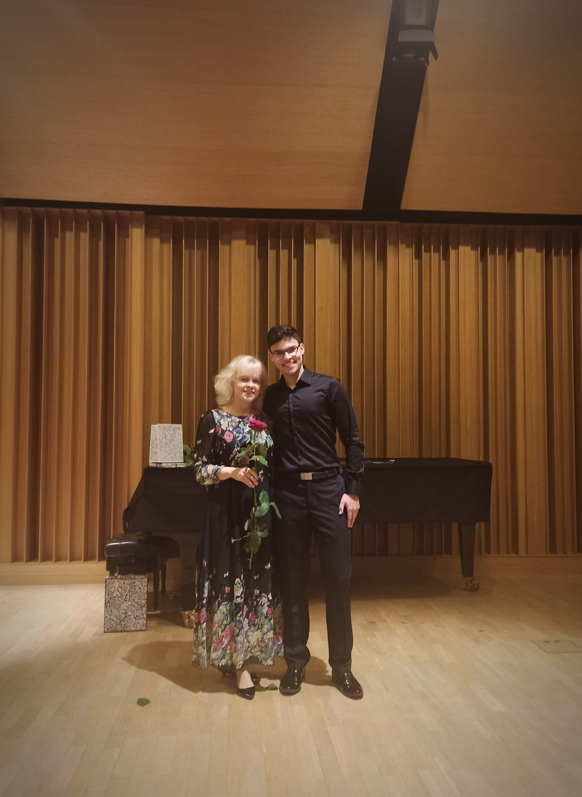
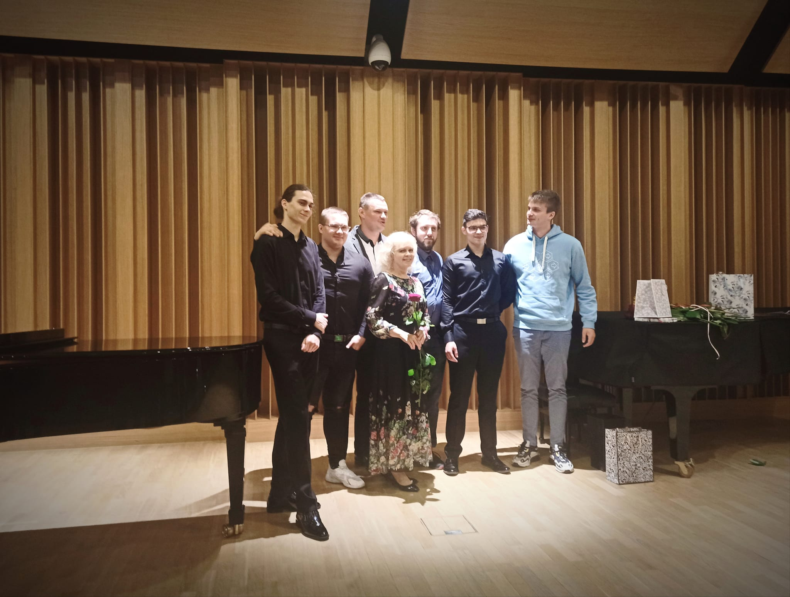
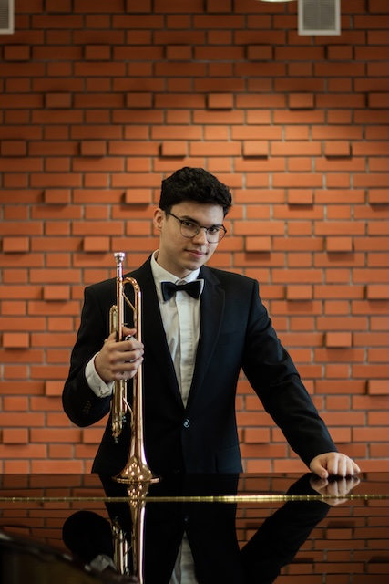

## Nuty a kod, czyli jak 13 lat kształcenia muzycznego sprawiło, że jestem lepszym devem i nie tylko

Ostatnio uświadomiłem sobie, że coraz częściej nachodzą mnie myśli, że największą stopą zwrotu jakiej doświadczam, jest tytułowe 13 lat szkoły muzycznej. Co więcej, niesamowite jest to, jak ten zainwersowany czas ma wpływ na prawie **KAŻDĄ** dziedzinę mojego życia. Jednakże na start może słowo o tym, jak te kilkanaście lat wyglądało.

## 13 lat w suwalskiej „muzycznej”, czyli mój fundament

Na samym wstępie chciałbym oznajmić, że miałem to szczęście mieć przez ten czas styczność z najlepszym dydaktykiem oraz... przyjacielem. Mój nauczyciel trąbki, Pan Paweł Misiukiewicz, przez ponad dekadę wpajał we mnie nie tylko to, że powinienem znać liczbę krzyżyków i bemoli w każdej gamie (o zgrozo! D:), ale również jak być zdeterminowanym, odpowiedzialnym i na swój sposób dojrzałym znacznie wcześniej, niż wymagały tego wiek i okoliczności poza szkołą.

Nie dość, że nauczyciel wymagał ode mnie wyżej wymienionych cech, to skłamałbym, mówiąc, że tylko to było wyzwaniem. Grającym "drugie skrzypce" nauczycielem była sama **trąbka**. Uważam, że jest to najbardziej uniwersalny, pięknie brzmiący instrument i nie wymieniłbym go na żaden inny (jest najlepszy wiadomo), ale... na swój sposób niewdzięczny. Kiedyś to przeklinałem, aczkolwiek dziś czerpię wiele korzyści, które wymagały wiele pracy, a ten instrument je na mnie wymuszał.

Po pierwsze, grając na trąbce, gramy na małym, ale jednak mięśniu, więc systematyczność to chyba najważniejsza rzecz (pomijam tu aspekty techniczne itd.). Zawsze mnie to denerwowało, że tacy pianiści może ćwiczą statystycznie dłużej, ale jak zrobią sobie tydzień przerwy w wakacje, to nie dzieje się żaden dramat. A trąbka? 3 dni wolnego == 10 dni wracania do formy – taki właśnie przelicznik przedstawił mi Pan Paweł i chyba naprawdę tak jest. Plus minus: tyle, ile robimy przerwy, potrójną ilość czasu musimy włożyć, by wrócić do tego samego miejsca.

## Systematyczność: 3 dni wolnego == 10 dni powrotu do formy

I tak oto wyłania nam się pierwsza cecha, którą praktykowałem przez 13 lat i staram się ją trenować do dzisiaj, mimo iż czasu z trąbką spędzam znacznie mniej. **Systematyczność** – chyba najlepsze, co dały mi te lata. Wyznaczając sobie jakiś cel, robienie tego regularnie naprawdę nie sprawia mi problemu; jest to we mnie wgrane jak Linux u typowego redditowca. Nie muszę chyba pisać, że czy to studia, czy praca, czy siłownia, czy **COKOLWIEK** wymaga w naszym życiu systematyczności. Takim oto sposobem udało mi się osiągnąć rzeczy zupełnie niezwiązane z muzyką – np. regularne treningi na siłowni, szlifowanie języka albo regualarne czytanie. Wiem, że zaraz ktoś sobie pomyśli: "Ziomuś, tyle osób ćwiczy i nie potrzeba do tego kilkunastu lat szkoły muzycznej XD". Oczywiście zgadzam się, aczkolwiek chodzi mi o tę naturalność – to, że jest to dla mnie zwykłe i, pokuszę się nawet o stwierdzenie, proste.

Kolejna cecha trąbki jest również ściśle powiązana z tą pierwszą. Widzimy już szkic, że trąbka wymaga czasu i systematyczności, a więc również świetnego **planowania**. Jak miałbym wyznaczyć coś, co w sobie lubię, to jestem naprawdę dobrym planistą, bo kolejny raz (będę to mówił dosyć często w tym poście) przez 13 lat była to codzienność, a nawet wymóg, by zrobić krok dalej.

## Egzamin techniczny i „muzykowanie”, czyli planuj bo nie zdasz

Egzaminy w szkole muzycznej składają się często z konkretnego programu. Dla każdego instrumentu wygląda to inaczej, ale na trąbce już na średnim poziomie, czyli na II stopniu, mamy dwa egzaminy. Jeden techniczny, gdzie gramy – jak sama nazwa mówi – rzeczy skupiające się na samej technice grania, sposobie wykonywania czy trudniejszych "nutach": duże skoki, wymagające tempo czy testowanie wytrzymałości. Drugi egzamin skupiał się na wykonaniu dłuższego utworu z akompaniamentem, np. fortepianu. Ja miałem przyjemność grać zawsze z najlepszą oraz niezawodną Panią Danutą Long. Mam nadzieję, że ani Pan Paweł, ani Pani Danuta nie będą mi mieli za złe, że wymieniam ich z imienia i nazwiska, ale nie sposób nie mówić wprost, jak bardzo oraz konkretnie czyj wkład doceniam i co wpłynęło na to, że patrzę na zainwestowane lata pracy z uśmiechem.

Ten drugi egzamin skupiał się bardziej na graniu "muzyki". To dosyć szerokie pojęcie, ale ogólnie mam tu na myśli wykonywanie utworu w poprawny, obiektywnie ładny oraz zgodny z intencjami kompozytora sposób. Do tego dochodziło zgrywanie się z akompaniamentem, więc wymagało to trochę innej, już bardziej zespołowej pracy, a nie tylko indywidualnej jak w przypadku pierwszego typu.

Zarysowałem mniej więcej wymagania – widać, że to nie jest żadne "hop-siup". Egzamin to naprawdę wiele godzin spędzonych na ćwiczeniu solo z nutami czy z Panią akompaniatorką. I właśnie te regularne egzaminy oraz oczywiście różne inne koncerty z orkiestrą i nie tylko (miałem okazję grać w różnych zespołach, orkiestrze szkolnej, a także miejskiej oraz, suma summarum, wielu pobocznych projektach, jak np. kolędowanie z suwalskimi siatkarzami: $link).

Na każdy z tych eventów był termin, zorganizowane próby i na każde z nich trzeba było się przygotować kawałek po kawałeczku, skupiając się na tym, co wychodzi nam najgorzej w danej chwili. Każdą etiudę, każdy utwór – dosłownie wszystko, co przechodziło "przez moje palce" – miało swój cel: czy to wprawki skupiające się na technice, czy akurat te dwie linijki, które wychodziły mi najsłabiej. Proces był prosty: zawsze musiałem sobie podzielić materiał tak, żeby zdążyć z zapasem, a w trakcie realizacji planu określić, co idzie najgorzej i skupiać się właśnie na tych częściach.

A i bym zapomniał: większa część egzaminów wymagała nauczenia się materiału na pamięć. Tutaj chyba nie muszę nic więcej mówić – bez pychy stwierdzam, że moja pamięć to żyleta i jedyne, co ją ogranicza, to czas, jaki mam na naukę oraz ile rzeczy realizuję naraz. Ostatnio przekonałem się, że nawet moja pamięć ma limity, ale to może przy okazji innego wpisu.

I tak szczerze: to były rzeczy, które towarzyszyły mi od siedmiolatka do – jakby to powiedział Pan Paweł – "starego konia" (tłumaczenie: nieprecyzyjne określenie na kogoś, od kogo już można wymagać; wiek raczej nieokreślony, w tym wypadku około 20 lat). Czym one się różnią od moich dzisiejszych wymagań w pracy? Dostaję "ticket" na Jirze, muszę rozplanować, co trzeba w nim zrobić, co zrobię najpierw, wyznaczyć termin i zidentyfikować, co wymaga najwięcej pracy i mocnego przetestowania.

## Debugowanie stresu: Jak nie dać się tremie?

Łatwo sobie wyobrazić, że nie tylko samo planowanie było nieodłączną częścią egzaminów i wystąpień, ale również **stres**. Szczerze mogę przyznać, że raczej należę do tych, którzy stresują się bardziej niż inni, mimo iż prawie zawsze czuję się dobrze przygotowany do wydarzeń, które ten stres wywołują. Niemniej jednak to, że wymagało to ode mnie więcej wysiłku, poskutkowało tym, że bardzo dobrze siebie znam. Wiem, że mam to szczęście, że stres odczuwam praktycznie tylko _przed_ wystąpieniami, a kiedy zaczynam działać – wszystko ze mnie ulatuje.

Stresowe sytuacje dotykają nas codziennie: na studiach przed oddaniem ważnego projektu, w pracy przy prezentacji przed całym zespołem. Ja bardzo dobrze siebie znam. Wiem, że przed muszę sobie zająć głowę i mam w zapasie kilka technik, które pomagają mi ten stres tolerować i nie pozwalać mu na dominację, a przede wszystkim na uczucie strachu czy wymuszanie rezygnacji z czegoś.

## Lekcja pokory: Co się nie dogra, to się dowygląda

W trakcie pisania tego wpisu uświadamiam sobie, że wszystko jest ze sobą bardzo połączone, a ja, ciągnąc ten sznurek powiązań, zauważam po raz kolejny, że z każdym pociągnięciem odkryję coś nowego. Porażki i oczekiwania to chyba moja największa bolączka. Za to czasem trochę nienawidziłem trąbki: jak psujesz i kiksujesz, to wszyscy o tym wiedzą. To nie jest jakieś brzdąknięcie na skrzypcach (może tak nie jest, ale tak to sobie wyobrażam); trąbka ze swoją donośnością i wyniosłością ogłasza, że ten tutaj kolega właśnie popełnił błąd – tak, żeby wszyscy słyszeli.

Do dzisiaj pamiętam koncert orkiestry oraz moje niezbyt udane wejście, o którym wiedzieli wszyscy (a może mi się tylko tak zdawało? Nigdy się tego nie dowiem). Pamiętam także komentarz dyrygenta, Pana Czarka (również serdecznie pozdrawiam – uważam, że dyscyplina i profesjonalizm zawsze były podstawą funkcjonowania dobrego zespołu i grając w tej orkiestrze, właśnie to dało się odczuć), że "Benek stawia wszystkim piwo". Naprawdę, więcej nie trzeba było. Pamiętam również koncert kwartetu dętego, w którym grałem, oraz występ, który widziała pół szkoły, bo KTOŚ zadbał o to, by go nagrać i rozesłać.

Także porażek było dosyć sporo. Wspomnę też, że trąbka wymaga naprawdę dużej pewności siebie. Jeśli będziemy grać cicho, unikać wyjścia przed szereg, to tylko spotęgujemy możliwość błędu. Dopiero na końcowym etapie mojego kształcenia rozliczyłem się ze sobą i postanowiłem po prostu grać, nie bać się i nie myśleć o tym, że jak popełnię błąd, to będzie on bardziej słyszalny. Paradoks jest taki, że właśnie starając się go ukryć, zwiększamy szansę na jego wystąpienie.

Zbierając to wszystko: widać, że radzenie sobie z porażkami i "twarda psycha" – i tutaj mam na myśli pogodzenie się przede wszystkim ze sobą, z faktem, że właśnie popełniło się błąd, i powiedzenie sobie: "dobra, idźmy dalej, postaram się bardziej następnym razem" – było kluczowe. Co więcej, po takim "udanym inaczej" koncercie nie było dopuszczalne filmowe ucieknięcie ze sceny albo pokazanie wszystkim, jak bardzo mi smutno. Do dziś pamiętam ostatnią zagraną okropną nutę felernego dnia koncertu kwartetu: odłożenie trąbki od ust, powstanie z szerokim uśmiechem, ukłon i zejście ze sceny. I dopiero wtedy zrzucenie z siebie tych pozorów.

No cóż, jak to się mówi: co się nie dogra, to się dowygląda... I w sumie nie chodzi tutaj o samą aparycję czy robienie dobrej miny do złej gry (dosłownie!). Chodzi bardziej o niepozwolenie sobie na słabość na scenie, na rozlecenie się w momencie, gdy piłka jest jeszcze w grze. Po prostu akceptacja stanu, ale zachowanie profesjonalizmu aż do samego końca, nawet jak poszło źle. Jak o tym piszę, to myślę o takim kapitanie, co idzie na dno ze swoim statkiem. Podobnie tutaj: nie dajemy sobie przestrzeni w tym konkretnym momencie na emocje, tylko trzymamy się w ryzach. Tak samo podchodzę do błędów dzisiaj: porażką nie jest popełnienie błędu, a niewyciągnięcie wniosków i popełnienie go drugi raz dokładnie w taki sam sposób.

Finalnie może dorzucę jeszcze takie największe wyzwanie, które zwieńczy moją historię w szkole muzycznej – koncert dyplomowy. Nie wiem, czy dla kogoś to może być pierdoła, ale dla mnie to było dotychczas największe wydarzenie. Koncert dyplomowy to około godzinny, otwarty koncert solowy (piszę z perspektywy trębacza), na który zaprasza się bliskich i znajomych (więc jak popsuć, to na oczach tych, na których najbardziej Wam zależy). Miałem tę przyjemność – za co jestem wdzięczny Panu Pawłowi – dostać wolną rękę co do utworów. Trochę czasu spędziłem na researchu, ale finalnie wykonałem utwory, które bardzo mi się podobały, a praca nad nimi była czystą przyjemnością (_Centennial Horizon_ oraz _Sonata_ Jean Hubeau).

Sam ostatni rok bardzo dobrze wspominam, bo byłem wtedy już na I roku informatyki, a jeździłem co dwa tygodnie z Poznania do Suwałk, by brać udział w próbach właśnie z Panem Pawłem. Ćwiczyliśmy głównie utwory dyplomowe i bardzo mi się to podobało, bo były to próby na dużej sali koncertowej i skupialiśmy się głównie na muzykowaniu – by wykonanie było po prostu tak dobre, na jakie mnie stać. I chyba wypalił mi ten koncert. Czemu chyba? Bo był to taki stres, że naprawdę mało z niego pamiętam, ale jedno wiem: dowiozłem i nie zawiodłem ani mojego nauczyciela, ani bliskich, a przede wszystkim siebie. Finalnie dyplom ukończyłem z najwyższą oceną celującą i w mojej głowie widnieje to jako jedno z większych osiągnięć. Za każdym razem, gdy mam przed sobą duże, stresujące wydarzenie, przypominam sobie ten fakt: że ogromem pracy i setkami godzin dowiozłem coś znacznie cięższego i większego. A więc czemu miałbym nie dać rady teraz?

 

I tak oto kończę ten przydługawy wpis. Nie pisałem tutaj o takich oczywistościach jak gra zespołowa, bo to wydaje mi się naturalne – cała orkiestra jest zgrana ze sobą często co do milisekund i co do herca. Nie pisałem też, jak bardzo doceniam dzięki szkole muzykę, jej kunszt oraz jak dużo emocji we mnie wywołuje. Jak czasem łapie mnie za serducho widok składu orkiestry.

## Coda: Podziękowania dla tych którzy są ze mną do dziś

Nie miałem okazji nigdy wcześniej podzielić się przemyśleniami ani co do szkoły, ani muzyki i całej tej historii. A więc z tego miejsca chciałbym podziękować:
- **Panu Pawłowi** – przyjacielowi, nauczycielowi nie tylko muzycznemu, ale i życiowemu;
- **Pani Danusi Long** – najlepszej akompaniatorce i sojuszniczce, gdy potrzebowałem adwokata u Pana Pawła;
- **Panu Grzegorzowi** – który angażował mnie w swoje ambitne projekty i wyjazdy (wspominam je do dziś!), mimo iż nie zawsze udało mi się idealnie wszystko dograć;
- **Panu Czarkowi** – dyrygentowi orkiestry (oraz sąsiadowi!), której z dumą byłem członkiem i czułem się tam jak profesjonalista;
- oraz **wszystkim znajomym i przyjaciołom** – niejeden koncert zagraliśmy, niejeden wyjazd zaliczyliśmy i przeżyliśmy razem wiele świetnych chwil.

I jak to się mówi: _last but not least_ – dziękuję **rodzicom**. To oni pchnęli mnie na I stopień, wozili setki kilometrów na zajęcia, cierpliwie czekali i przyjmowali na siebie niejedną informację o tym, że coś sknociłem. Jednak jeszcze bardziej dziękuję im za to, że **NIE PCHNĘLI** mnie na II stopień. Czuję, że to było najważniejsze -> to była Moja decyzja (tak, przez duże „M”) i właśnie to przeświadczenie dawało mi największego kopa sprawczości.

Patrzę na ten czas z sentymentem i nie powiem – staram się jakoś angażować w wolnym czasie w sferę artystyczną, czy to teatr czy sam grając sobie kolejny raz "Centennial Horizon" bo czuję, że jest ona moją bardzo dużą i nieodłączną częścią. 

Swojego wykonania nie mam, ale może jak ktoś byłby zainteresowany i chiał przesluchać mój repertuar to zachęcam udać się w tę pochłaniającą podróż: 





Dzięki za przeczytanie tego posta. Może i Ty zaczniesz uczyć się na czymś grać albo zachęcisz kogoś, kto się nad tym zastanawia? Do następnego!