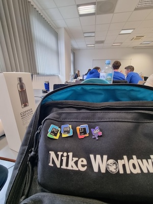
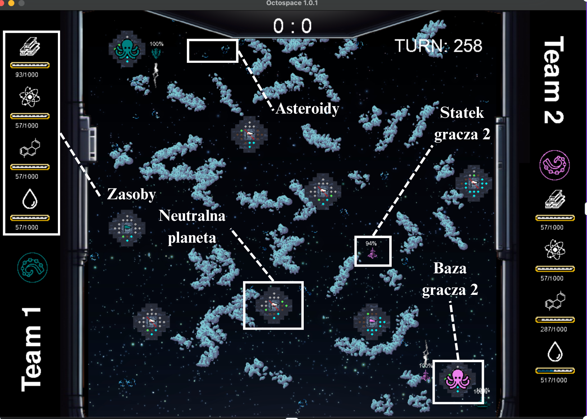
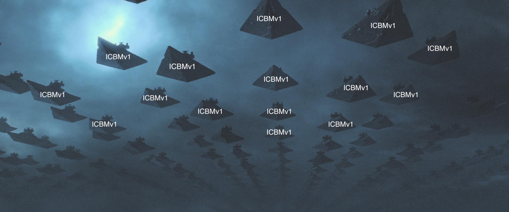
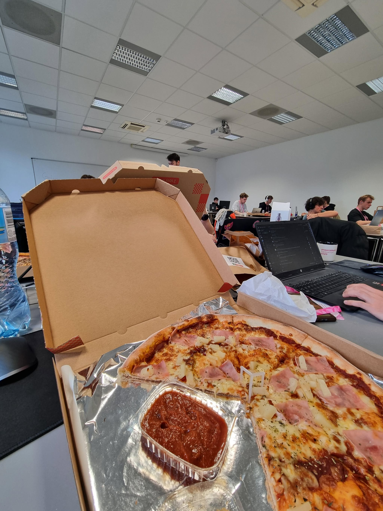
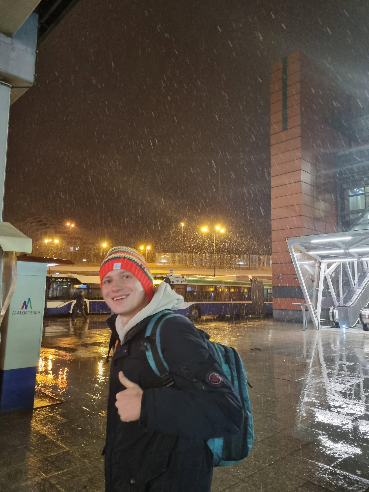

W dniach **16-18.03.25** razem z zespołem mieliśmy okazję wziąć udział w hackathonie w Krakowie. Uczestniczyliśmy już w poprzedniej edycji, więc jeśli chcecie dowiedzieć się więcej o tym wydarzeniu, serdecznie zapraszam do lektury wpisu [Macieja](https://kaszkowiak.org/blog/ensemble-ai/). 
W skrócie – było to nasze pierwsze starcie z tworzeniem sieci neuronowych. Co więcej, uczyliśmy się wszystkiego na bieżąco, więc wyzwanie było naprawdę spore. Mimo wszystko udało nam się zająć **12 miejsce**, co było dla nas duużym osiągnięciem!

## PROLOG - przeddzień walk

Założenie na ten hackathon mieliśmy proste: wiemy już więcej o AI i jeśli przyjdzie nam zmierzyć się z pisaniem sieci neuronowej, to jesteśmy na pewno lepiej przygotowani niż poprzednim razem. 
Wspólnie z **Jakubem Binkowskim** mieliśmy również okazję przejść przedmiot **Sieci neuronowe**, co dało nam znacznie szerszy pogląd na przetwarzanie obrazów, techniki regularyzacji i sposoby zapobiegania przeuczenia modeli. 
W piątek postanowiliśmy też zapoznać się z materiałami przesłanymi przez organizatorów. Mimo że nie był to dla nas łatwy materiał, udało nam się przebrnąć przez kilka z nich i wyciągnąć coś wartościowego. Jak okazało się później, mogliśmy się po prostu porządnie zrelaksować...

## Początek - intuicja ponad wszystko

A więc lądujemy w sali na wystąpieniach otwierających i dostajemy kilka kluczowych informacji.

Po pierwsze, dzięki współpracy organizatorów z **Cyfronetem**, każdy zespół miał do dyspozycji naprawdę potężne maszyny – i tutaj poczułem, że to solidnie przyspieszy naukę naszych modeli. Liczby i moc obliczeniowa zrobiły ogromne wrażenie, więc kolejny raz mogę zbić piątkę z organizatorami za świetny pomysł. 
Następnie dowiedzieliśmy się, jakie będą zadania, i tutaj spotkało nas lekkie zaskoczenie. Okazało się, że każdy zespół musi wybrać jedną z dwóch ścieżek:

1. **Pierwsza** – składała się z czterech podzadań dotyczących **uczenia adwersarzowego, kradzieży modeli** i kilku innych tematów związanych z szeroko pojętym uczeniem maszynowym.
2. **Druga** – zadanie polegało na nauce bota do gry stworzonej przez organizatorów. Boty miały grać między sobą, a zasady rankingu były proste:
   - za remis drużyna dostaje **0.5 pkt**,
   - za wygraną **1 pkt**,
   - za przegraną – wiadomo... **smutne i okrągłe 0 pkt**.

Wow, nie wiedzieliśmy, że tak szybko dopadnie nas widmo decyzji, ale na szczęście mieliśmy na nią ponad **8 godzin**, więc był czas na testy i ocenę, w którym zadaniu będziemy czuć się najlepiej.
Po wykładach chwilę się rozluźniliśmy, podeszliśmy do kilku stanowisk – między innymi do **JetBrainsów**. Razem z Szymonem jesteśmy fanami ich IDE, więc była to naprawdę fajna gratka. Także od dzisiaj oficjalnie staję się ich chodzącą reklamą, ale co tam – naprawdę doceniam jakość ich rozwiązań. 😎

## 3, 2, 1, start! - wyścig rozpoczęty!

Na początku, przez lekkie niezrozumienie zasad, postanowiliśmy jak najszybciej wypuścić **pierwszą wersję bota** – byliśmy przekonani, że **rating** będzie naliczany co godzinę, a finalny ranking będzie sumą poszczególnych pojedynków z trawania całego hackathonu. 
Wypuściliśmy więc coś prostego, ale obrazowo nazwanego – **ICBM**. Rakieta leciała **prosto z naszej bazy do bazy przeciwnika**. Gdy tylko mieliśmy zasoby, odpalaliśmy kolejną rakietę. 
I, ku naszemu zaskoczeniu, takie rozwiązanie dało **całkiem niezłe efekty** na samym początku – **na tyle dobre**, że poczuliśmy wiatr w żaglach i postanowiliśmy w pełni skupić się na tym zadaniu.

## **OctoSpace – zasady gry w pigułce** 🚀

W grze celem jest całkowita dominacja. Można wygrać na dwa sposoby – eliminując przeciwnika poprzez przejęcie jego planety lub zdobywając więcej punktów po 1000 turach (w końcowym etapie organizatorzy zwiększyli tury do 2000, bo było za dużo remisów). Plansza o wymiarach 100x100 jest początkowo pokryta mgłą, a eksploracja statkami odkrywa jej kolejne obszary. 
Statki pozwalają walczyć i zdobywać planety. Standardowa prędkość ruchu to 1 lub 2 pola na turę, jednak wchodząc w spowalniającą mgłę, statek porusza się trzykrotnie wolniej, a zderzając się z asteroidą, otrzymuje obrażenia. Statki mogą atakować na dystans do 8 pól, ale po każdym strzale z założenia miało następować 10-tur cooldownu, jednak odkryliśmy, że finalnie to nie było żadnego cooldown-u :D. Leczenie jednostek jest możliwe tylko na własnych planetach, gdzie odzyskują 1 HP na turę. 
Aby powiększać flotę, potrzebujemy surowców, które zdobywamy kontrolując planety. Każda planeta składa się z 16 pól zasobów, a ilość pozyskanych surowców zależy od ich rodzaju i liczby kontrolowanych pól. Początkowa planeta ma wszystkie zasoby w równych proporcjach, ale inne planety mogą mieć ich nierównomierny podział. 
Zdobywanie planet odbywa się poprzez wpadnięcie statku na planetę. Jeśli planeta jest nieprzejęta, przejmujemy ją natychmiast. W przypadku zajętej planety rozpoczyna się proces przejęcia, który trwa kilka tur. Jeśli planeta była w trakcie przejmowania przez przeciwnika, można zneutralizować jego postępy i odzyskać kontrolę.

## Nasz plan

Nie mieliśmy złudzeń – żaden z nas **nigdy** wcześniej nie tworzył modelu opartego na Reinforcement Learningu. Jedyne, co mieliśmy na ten temat, to zajęcia sprzed tygodnia, na których razem z **Jakubem** poznaliśmy podstawowe problemy i założenia RL.  
Nie porzuciliśmy od razu wizji stworzenia czegoś więcej niż heurystyk, ale od nich chcieliśmy zacząć. Wiedzieliśmy, że i tak będą nam potrzebne – choćby po to, żeby w razie czego móc trenować model przeciwko różnym strategiom. 
Jednakże... **spoiler alert** – dowiedzieliśmy się, że na maszynie testowej nie można korzystać z bardziej **wysokopoziomowych narzędzi do RL**. Możemy używać **tylko czystego PyTorcha** (only sad reactions). 
I tak oto przybiliśmy gwóźdź do trumny i zamiast walczyć z ograniczeniami, postanowiliśmy przerzucić wszystkie siły na stworzenie najmocniejszej heurystyki, na jaką nas stać.

## Od rakiety do floty - nasze pomysły

Na starcie nasza **heurystyka** zawierała tylko jeden typ statku – **ICBM**. Jego zadaniem było czyste bombardowanie bazy przeciwnika. Proste, ale skuteczne – nawet bardziej niż skuteczne, bo przez pierwsze **12** godzin hackathonu zajmowaliśmy **pierwsze miejsce w tabeli**XD. To było dla nas spore zaskoczenie.

### ICBMv2 - pierwsze ulepszenie
Kolejnym krokiem była wersja **ICBMv2**, która miała zaimplementowany **pathfinding**, czyli lokalne znajdowanie najlepszej ścieżki, omijającej asteroidy i mgły spowalniające. W strategii bombardowania bazy przeciwnika było to kluczowe, bo każde spowolnienie naszej rakiety działało na naszą niekorzyść.

### Defender - pierwsza linia obrony
**Defender** to nasza ostoja i pierwsza pomoc w systemie bezpieczeństwa. Jego zadanie było następujące:

Ustawić się pod odpowiednim kątem i razem z drugim defenderem tworzyć ogień krzyżowy, pokrywający większość ataków na naszą bazę. 
W razie kryzysu pełnił funkcję **pierwszej pomocy** – jeśli baza była atakowana, a nie mieliśmy wystarczających zasobów na nowy statek (stworzenie nowego statku w trakcie przejmowania zatrzymywało przejmowanie), defender leciał na ratunek i odbijał bazę.

### Explorer - zwiad i zbieranie zasobów
Wiedzieliśmy, że zmasowany atak bez zasobów szybko się skończy, więc potrzebowaliśmy kogoś, kto nie tylko zdobywa surowce, ale i odkrywa mapę.

**Explorer** korzystał z pathfindingu, ale... nie udało nam się stworzyć idealnego algorytmu szukania ścieżki, więc zdarzało się, że się blokował. W finalnej wersji, jeśli utknął, zmieniał się w **rakietę**, dodatkowo zmieniając standardowy wektor ataku naszej strategii (standardowym wektorem była główna przekątna mapy).
Btw. Jak widzę nagłą przemianę explorera w rakietę to mam przed oczami ten obraz:

### Backdoor - cichy zabójca
Analizując naszą taktykę, zauważyliśmy, że jest wrażliwa na ataki z granic mapy. Idąc tym tropem, doszliśmy do wniosku, że przeciwnicy też mogą nie zabezpieczać się wystarczająco. 
Tak powstał **Backdoor** – cichy zabójca, który po dotarciu za bazę przeciwnika i odczekaniu odpowiedniego czasu niespodziewanie ją atakował. 
W finalnym rozrachunku nie okazał się wystarczająco efektywny, by wprowadzić go do naszej strategii, a czas nie pozwalał nam również dokładnie przetestować jego wpływu.  
Jednakże jego sposób działania był na tyle komiczny, że muszę to pokazać XD.

<video width="640" height="360" controls>
  <source src="/p/backdoor_attack.mp4" type="video/mp4">
  Your browser does not support the video tag.
</video>

Na nagraniu widać jak zielone backdoory gracza pierwszego skradają się na krańcu mapy, odczekują chwilę, a następnie razem atakują. Na przekątnej natomiast widać różowe statki gracza drugiego, czyli wersje ICBM naszych statków.

### Smażenie wrogów - dodatkowy atut rakiet
Do tej pory nasze boty nie wykorzystywały strzelania, ale na końcowym etapie hackathonu je dodaliśmy – i to działało naprawdę dobrze. 
Każdy napotkany przeciwnik, póki był w naszym zasięgu, był kolokwialnie mówiąc **grillowany** 🔥. Jednak w naszej głównej taktyce, gdzie statki nie były statkami, a latającymi rakietami planeta → planeta, ta funkcjonalność niestety spowalniała je, co wpływało negatywnie na ich efektywność.

---

## Pomysły, na które nie starczyło nam czasu

### Wariant Szymona - stackowanie rakiet i zmasowany atak
Plan był prosty – gromadzimy rakiety, a potem wysyłamy je w jednym, **miażdżącym ataku**. 
Brzmi jak coś, co naprawdę mogłoby zadziałać, ale... niestety nie starczyło nam czasu, żeby to przetestować :(

## Kilka usprawnień w procesie tworzenia Bota

Warto zaznaczyć, że **nie samym kodem nasze rozwiązanie żyło**. 
Ponieważ przesyłany bot musiał zmieścić się w jednym pliku, a nasza struktura zawierała ich wiele, w tym wspólne funkcje dla różnych modułów, stworzyliśmy skrypt, który łączył plik `utils.py` z naszą wersją agenta (bota). 
Każdy agent miał swój własny folder i moduł. Proste, ale jakże skuteczne.  Żeby porównać dwa rozwiązania, wystarczyło w skrypcie podać nazwy folderów, w których znajdowali się nasi agenci i... **cyk!**. Dwa boty rozpoczynały batalię między sobą – za jednym kliknięciem Entera. Brzmi to bardzo prosto, ale uwierzcie mi, że sam pewnie nabiłem ponad sto odpaleń tego skryptu, a przy takiej liczbie każde dodatkowe kliknięcie ma znaczenie.

### CI/CD - automatyzacja wykrywająca błędy
W trakcie hackathonu pojawiał się nie jeden błąd w grze (kodzie źródłowym), a organizatorzy naprawiali je na bieżąco. Wpływało to na kompatybilność naszych botów, więc dodanie automatyzacji pozwoliło nam sprawdzać, czy nasze konfiguracje nadal działają zgodnie z nową wersją gry.
Dodatkowo mieliśmy w planach równoległe i automatyczne testowanie nowych botów, ale... po raz kolejny nie starczyło nam na to czasu.

## Finał - triumf prostoty

Nasza **finalna heurystyka** prezentowała się następująco:

### 🔥 Rdzeń: rakiety ICBM
Jeśli defenderzy są na miejscu i nie wypada tura na tworzenie Explorera, to **bombardujemy przeciwnika ICBMv2**. Dodatkowo na samym początku gry wypuszczamy dwie wersje rakiety v1 oraz v2. 

### 🚀 Wsparcie: Explorer
Co jakiś czas do gry wchodził Explorer – jego głównym zadaniem było szukanie planet z zasobami. 
Jeśli uległ zakleszczeniu, zmieniał się w rakietę ICBMv2, randomizował wektor ataku.

### 🛡️ Bezpieczny mur: Dwójka Defenderów
Bez większych zmian – jeśli baza jest atakowana i nie możemy jej obronić nowym statkiem, to **Defender zmieniał się w medyka**.  
W innym przypadku prowadził ciągły ogień krzyżowy, smażąc wszystko, co popadnie.

---

I tak! **Taka heurystyka dała nam 3. miejsce!** 🏆

Może wydawać się trywialna, ale naprawdę przyniosła efekty. Jak widać, nie rzuciliśmy się na falę szczęścia, tylko w testach i ewaluacjach to podejście okazało się najefektywniejsze. 
A jeśli **działa, to znaczy, że jest co najmniej dobre**.

### Gamechanger - wiedza prosto z kodu źródłowego
Warto też zaznaczyć, że przez cały czas trwania hackathonu analizowaliśmy kod źródłowy gry. Dzięki temu poznaliśmy jej działanie od samych podstaw, dowiedzieliśmy się, że **czasami zamiast strzelać, lepiej uciekać**, a także odkryliśmy wiele innych sprytnych taktyk, które wykorzystaliśmy w naszym finalnym rozwiązaniu.

## Epilog
Pisząc ten post, nadal czuję naprawdę **dużą satysfakcję**, ale przede wszystkim cieszę się z czasu spędzonego z drużyną.  
Naprawdę to **świetne uczucie** – walczyć ramię w ramię z kolejnymi przeciwnościami, mając u boku taką ekipę jak nasza. Co więcej, sam event, mimo drobnych potknięć, był **nie tylko ambitny, ale też świetnie przemyślany**.

Na wielu hackathonach wybór zwycięzcy opiera się na subiektywnej opinii jury, a tutaj wygrywa matematyka – **kto wyżej w rankingu, ten lepszy**. I to jest coś, co naprawdę doceniam. 
Mam wielką nadzieję, że **za rok ponownie uda nam się wziąć udział** w kolejnej edycji wydarzenia. Wiem, że następnym razem będziemy jeszcze mocniejsi i wierzę, że znów staniemy w szranki – zarówno ze swoimi słabościami, jak i z wieloma naprawdę utalentowanymi i ambitnymi deweloperami.

---

### Podziękowania

**Dzięki ekipo!**  
**[Maciej Kaszkowiak](https://www.linkedin.com/in/maciej-kaszkowiak/), [Jakub Binkowski](https://www.linkedin.com/in/jakub-binkowski-80136825b/), [Maciej Mazur](https://www.linkedin.com/in/maciej-mazur-90064b2b4/) i [Szymon Pasieczny](https://www.linkedin.com/in/szymon-pasieczny-4a664b215/)** – jak już mówiłem, dzięki wam hackathon to nie tylko kodzenie, ale też świetnie spędzony czas z dużą dozą śmiechu, żartów i tryhardu. Czyli mieszanka w idealnych proporcjach.

**Dzięki Adamowi Mazurowi** – przewodniczącemu koła **"Ghost"** na Politechnice Poznańskiej. Dzięki jego zaangażowaniu najprawdopodobniej otrzymamy finansowanie od uczelni, a to naprawdę dobre uczucie – mieć świadomość, że nasza uczelnia wspiera nas w tym, co robimy.

**Dzięki organizatorom!** – bez was nie byłoby tego eventu. Czuć, że wykonaliście kawał dobrej roboty – dużo rzeczy zostało poprawionych względem poprzedniej edycji i wiem, że ta tendencja będzie utrzymana.

Kto wie, może kiedyś hackathon odbędzie się na Politechnice Poznańskiej? 🤔

---

Dzięki za poświęcony czas na przeczytanie tego wpisu! Na dole wrzucam kilka fotek z wydarzenia, a jak dojdą jakieś nowe, to postaram się je uzupełnić!

 

