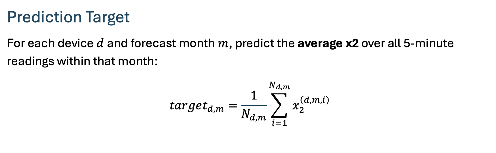
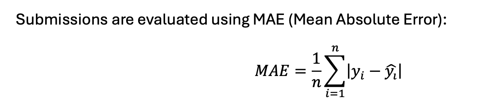

## Prologue
No excuses, I delayed writing this post for a long time. Post-hackathon fatigue can hit hard, and describing what we achieved during those 24 hours is not easy, because there were tons of attempts and many different approaches. But now, looking through the train window on the way from Suwalki to Poznan, I feel the creative flow taking over, just like a random Windows update on a Tuesday at 12:40.

Imagine a table with 65 million rows. I know that is hard to picture, so here is a shortcut: 65 million rows in Times New Roman is roughly 1,300,000 A4 pages.

Now imagine reading all 1,300,000 pages and then being asked to predict energy consumption from them. Not exactly easy, so as we all know, the first thing you would usually pull out for this kind of problem is decision trees. We did the same at first. But after a few hours, we decided to do something completely different and used a model that was originally built for almost the opposite kind of task, and only recently started being adapted to many other domains. Come along if you want to see a forest of regression trees first, and then I will tell you how that one crazy experiment gave us **1st place out of 45 teams in this task**, and why sometimes it is worth throwing the safe instruction manual out the window.

## **A short intro to the EnsembleAI hackathon format**
To understand the emotions my team and I felt during this intense battle, we need to start with the format itself, because it is at least unusual and delivers dopamine hits stronger than Instagram Reels.
Each of the 4 tasks is scored separately, and points are assigned based on submitted solutions specific to each task. In the case of task 3, which I worked on, this was a CSV file with monthly energy consumption predictions for a specific time window. Because of this structure, the center of the hackathon was the leaderboard page, where each rank in a task translated into points.
Submissions could only be sent at predefined intervals, among other reasons to avoid DDoS-ing the servers. So, after each file upload, there was always that tense waiting period: did our solution improve our position, and by how much?


## **But let us start from the beginning: what, how, where, and why?**
The task was defined by one of the hackathon partners, Euros Energy, which also provided the data. So what was it about? In the problem statement, we were shown how mass electrification is a milestone in Poland's energy transition. But for energy distributors, the rapid growth in heat pumps creates major challenges. As a result, accurate energy demand forecasting becomes essential to prevent grid overload and potential outages.

## **The data we got**
When talking about machine learning and prediction, it would be a shame not to start with the data, so let us begin there: each team had access to 3 main datasets:

- Train: October 2024 - April 2025
- Validation: May 2025 - June 2025
And also:
- Test: July 2025 - October 2025

We generated predictions on that last dataset with every submission, but this is where the twist appeared. It used the Kaggle-style Public vs Private Leaderboard mechanism. The Test set was technically available to everyone, but it did not include the target "y" values. So there was no way to retrain on it or validate final quality on our own.

For the full 24 hours, we were essentially flying blind, seeing leaderboard feedback only on a small slice of that data. And even those points did not decide the final ranking. The final score that determined the podium was computed on the hidden part of Test, whose true results nobody knew until the very end. That made the final minutes of the hackathon pure emotional roulette, because summer behavior could be very different from autumn and winter, which were our main training periods.

In short: we had around 600 sensors sending logs every 5 minutes across those periods, which gave us around 65 million rows (10.42 GB!) to analyze.

## **Goal**
Short and to the point: we were not predicting instantaneous power, but the monthly average value of the grid load indicator (x2) for each device. So we moved from high-resolution data (readings every 5 minutes) to monthly aggregates. Below is the exact formula from the task description:



And the metric on both the live and final leaderboard was MAE:



So, time to describe our process and the path that led us straight to 3rd place in the whole hackathon.


## **Feature engineering and data preprocessing**
At the beginning, of course, we had to inspect the data and distributions closely, and I did exactly that. But before even that, at the very end of the organizer instructions, we found this section:


At that moment I thought we should start there and add to each sensor information about which energy distributor it belongs to. Surely every team would do that, right? Right?? Well, in the end it turned out they did not :D and who knows, maybe those were the extra points we needed.

The data included latitude and longitude for each sensor, so I decided to locate each device in a specific voivodeship using the GeoPy API. It turned out the data was likely anonymized or noisy, because some coordinates were incorrect and GeoPy could not resolve them. In those cases, we used KNN to find the nearest correctly located sensor with an assigned operator. Then we built a mapping from voivodeship to one of the distributors, such as PGE, Enea, or Tauron, and that gave us our first interesting feature.
Another major step was aggregation. There was a huge amount of data, enough to overwhelm many models, so we moved to hourly aggregation. This significantly reduced the dataset, removed noise from 5-minute logging, made patterns easier to detect, and still remained a meaningful prediction unit.


Overall, the problem was interesting because at first I approached it as time series forecasting. But after deeper analysis, this is really a **plain regression problem**. Sure, measurements come every 5 minutes, but the target is MONTHLY! That is a strong aggregation, and as my professor used to say: we should use the sharpest axe possible for this prediction, not a scalpel. Even better, a universal axe that can learn important autumn features and then transfer them to summer.

## **First approach**
As a first approach, I chose CatBoost. We had both categorical and numerical features, so boosting trees seemed like a good fit. So we went all in with CatBoost and these hyperparameters (without tuning at that point):
```python
CatBoostRegressor(
	 iterations=800,
	 learning_rate=0.05,
	 depth=6,
	 loss_function="MAE",
	 cat_features=CATEGORICAL_FEATURES,
	 random_seed=42,
	 verbose=100,
)
```
And boom, it hit hard: our first model got 0.0074 MAE. 0.0074! That is really low, especially with monthly aggregation and this kind of data.


After that came rounds of feature engineering, trial and error, and deep exploration. In the end, while fighting teams that eventually reached similar scores and overtook us, our final CatBoost move was Optuna tuning to squeeze out everything we could. We got MAE = 0.0044. Every model iteration was a battle, and I still think reaching that value on trees alone was a great result. Especially because, spoiler alert, Transformer is much heavier, so comparing these two directly is hard since they sit on opposite ends of efficiency and compute requirements. Still, given our skills and experience, I consider that result very solid.

## **Autobots, roll out**
When did we abandon our beautiful tree model? First, when I felt that further changes and feature engineering were no longer moving the needle, or improved too little to climb the ranking. Second, when the Transformers team beat us and, in a way, inspired us.
After a short research phase, I decided to bring in truly heavy artillery: the Feature Tokenizer Transformer. It is a relatively fresh architecture that has recently been gaining popularity in Kaggle competitions.


### General idea and how Feature Tokenizer Transformer works

The explanation below is based on the paper that introduced [FT-Transformer](https://arxiv.org/abs/2106.11959). The diagrams also come from that source.

At a high level, in our dataset and tabular datasets in general, we mostly have two feature types: categorical and numerical.

Transformers were widely used in NLP, for example in generative models like GPT and encoder-decoder models like T5. So how do we force this architecture to process categories and numbers together, instead of token embeddings?

### Main component: Feature Tokenizer

That is exactly what Feature Tokenizer does. It is the core gem of this approach and it works in two ways:

- **Numerical features:** relatively simple -> we take a scalar, multiply it by a learned weight vector of embedding size, add bias, and get an embedding of the target dimensionality.

- **Categorical features:** similar to NLP token handling. Each category is transformed into _one-hot encoding_, then multiplied by a weight matrix. In simple terms, this is selecting a row from that matrix plus bias.


>_One-hot encoding_ means representing a categorical value as a binary vector. It sounds odd, but it is simple. Example: feature "Color" in a motorcycle dataset, with two values: red and black. Represented as positions [Red, Black]. Red becomes [1,0], black becomes [0,1]. Any other color (for example green Kawasaki) becomes [0,0].

All feature values are concatenated into a large matrix **_T_**. Then we prepend a randomly initialized `[CLS]` vector of the same embedding length. The full matrix is processed by the Transformer, so **_T_** effectively represents one row of our table (including that additional `[CLS]` token). Diagram below:


Why `[CLS]`? CLS stands for _Classification_, and its role is to aggregate information across layers during forward pass.

Then, as shown, our **_T_** vector enters the Transformer, gets normalized, and goes into _Multi-Head Self-Attention_. This layer lets the model build the context needed for near-optimal output. In our case, context means other table columns, i.e. other values in matrix **_T_**. That context is what ends up stored in `[CLS]`.

Why **Multi-Head**? Just like one head in language models may capture grammar and another emotion, here each head searches for a different context in the row. So one head can track hard geographic dependencies (consumption vs voivodeship/operator), another can capture technical relations (pump model vs consumption), and the `[CLS]` token gets a multidimensional picture instead of one averaged blur.

At the end, we discard all rows in **_T_** except `[CLS]`, because it contains the essence needed for downstream prediction in our task.

That is the high-level version of how it works under the hood.

##  Applying FT-Transformer in our task

###  Final feature engineering
During those 24 hours I tested many feature ideas, often also asking an LLM for suggestions. Below is what we finally kept for the Transformer training, and some of these were also used for CatBoost.
- **deviceType** helps the model capture differences in operating behavior.

- **x3** is an additional categorical feature carrying information about heating curve type.

- **operator** allows the model to account for differences in operating conditions and policies.

- **voivodeship** adds geographic context affecting climate and seasonality.

- **device_operator_combo** captures interactions specific to device-operator pairs.

- **t1_mean-t13_mean** is the average level of signals t1-t13 in a time window.

- **t8_max** captures extreme peaks and heavy-load episodes.

- **t8_std** measures signal variability.

- **t7_max** captures short extreme system states.

- **t4_min** is useful for detecting deep drops.

- **delta_load** captures load dynamics over time.

- **delta_source** reflects source-side switches and jumps.

- **cwu_demand** is DHW demand affecting system operation directly.

- **delta_temp_out_in** captures output-input temperature difference and process efficiency.

- **cwu_spike** flags sudden DHW demand jumps.

- **hour_sin** encodes daily cyclicity without artificial 23:00/00:00 discontinuity.

- **hour_cos** complements hour_sin and reconstructs full daily phase.

- **month_sin** captures yearly seasonality continuously.

- **month_cos** complements month_sin to close annual cyclic representation.


### Under the hood: network, head, and hyperparameters
Theory is one thing, but here is how we adapted those Transformer blocks to our dataset.

In theory, numerical features are multiplied by learned vectors. We went a step further: each numerical feature was first passed through a small MLP before entering the Transformer:
```
nn.Sequential( nn.Linear(1, embed_dim // 2), nn.ReLU(), nn.Linear(embed_dim // 2, embed_dim), )
```
We did this because not all features influence the target linearly, so we injected nonlinearity before Transformer input.

Categorical features were embedded in the standard way, with extra OOV slots in case an operator or deviceType was unseen.
After that, standard FT-Transformer stack runs. Hyperparameters we used:
- Embedding size: 64
- Multi head attentions: 8
- Transformer layers: 3
- Dropout: 0.1

After all Transformer layers, we reach the regression head. The logic is simple: we extract only `[CLS]` from the full matrix. Why this token? Because attention lets it absorb information from all other columns and keep a condensed representation of the row.

The remaining vectors (for example region-related) are discarded, because their job is done. `[CLS]` goes into a small head with normalization and ReLU, which compresses everything into one final value.

At the end, we added a hard safety guard. Since we predict energy consumption, negative outputs are physically meaningless, so we clipped all values below zero.

### Training phase

A few words on training strategy. We tried to be efficient, so we would not waste precious hackathon time. We used two phases:

**Phase 1: the proving ground** Instead of training on everything, we made a hard time cut at the beginning of February. The model trained on data before that date and predicted what happened after February 1. Why date-based split and not random? Because random split would leak future information into the past in this energy setting. We also used Early Stopping so training stopped when improvement stalled. All checkpoints were saved. This gave us realistic MAE before sending anything to organizers.

**Phase 2: full speed ahead** After many tests in Phase 1 confirmed architecture stability, we moved to Phase 2 -> **more data = better model**. We removed the February 1 cutoff and fed all available historical training data. This heavily fed and tuned model generated final predictions for our submission file.

### Small tip at the end
The Transformer learned a scaled version of mean average x2 using StandardScaler. Neural networks generally like normalized targets, so this likely improved stability and convergence. Before writing outputs to submission, predictions were inverse-scaled back to target units.


##  Epilogue

So why did this work, and now we can safely say it **did** work? It is hard to be 100% certain, because large neural models are black boxes. Most likely each practice contributed a bit. But if I had to pick one stronger factor, I would highlight _Multi-Head Self-Attention_.
The core challenge was extracting transferable knowledge from autumn-winter months, when heat pumps run hard, and carrying it into summer, where usage is much lower. In FT-Transformer, context modeling could learn how strongly features influence outputs and when specific attributes should matter more. Our nonlinear MLP for numerical values likely enriched those representations too. Transformers tend to generalize well, and I believe that played first violin here.
Still, credit to the teams right behind us. Even though the second team scored worse than us (by over 50%), we were probably the only team that brought in such heavy artillery as Transformer for this task. Others used tree models like LightGBM, and given the complexity gap, they did excellent work. But in the end, we took the lead, and we can be proud of our solution.

## So... next year?
Another EnsembleAI and another great experience. Huge thanks to the organizers for such a great event, and to my DNS team ("Druzyna Nieobecnego Szymona"):
- [Jakub Hudziak](https://www.linkedin.com/in/jhudziak/)
- [Jakub Binkowski](https://www.linkedin.com/in/jakub-binkowski-80136825b/)
- [Maciej Kaszkowiak](https://www.linkedin.com/in/maciej-kaszkowiak/)
- [Maciej Mazur](https://www.linkedin.com/in/maciej-mazur-90064b2b4/)
- and of course me :D

We brought the fire, guys, and I hope this was not the last time. I know I keep repeating myself, but I mean it every single time. See you next year?
