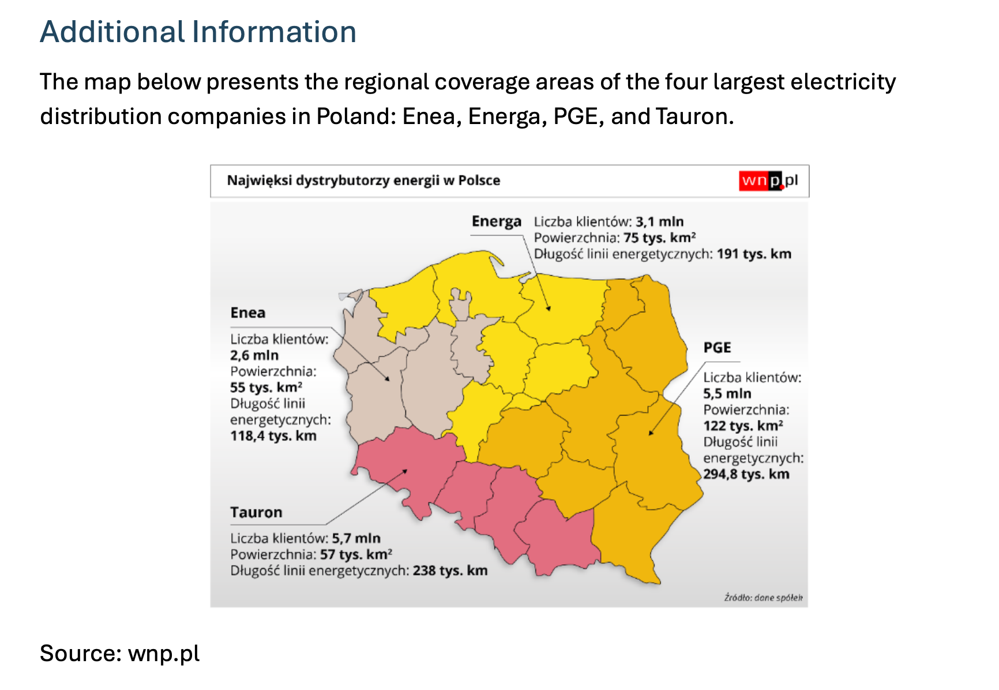
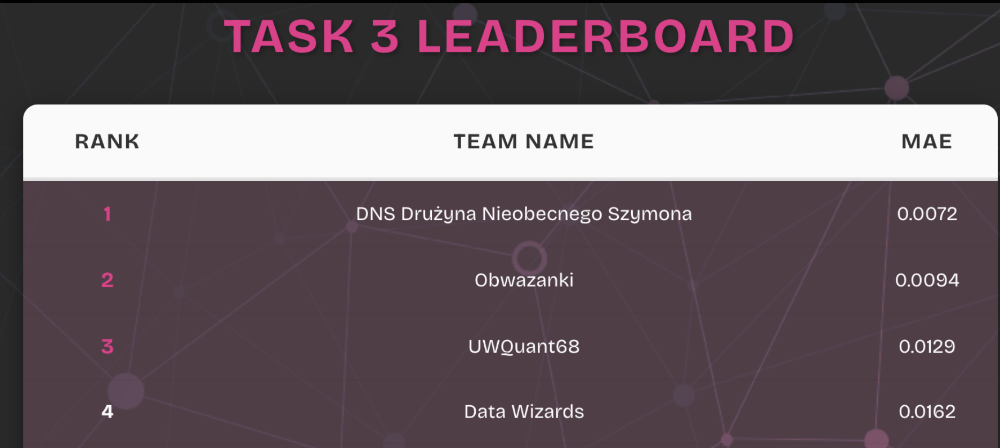
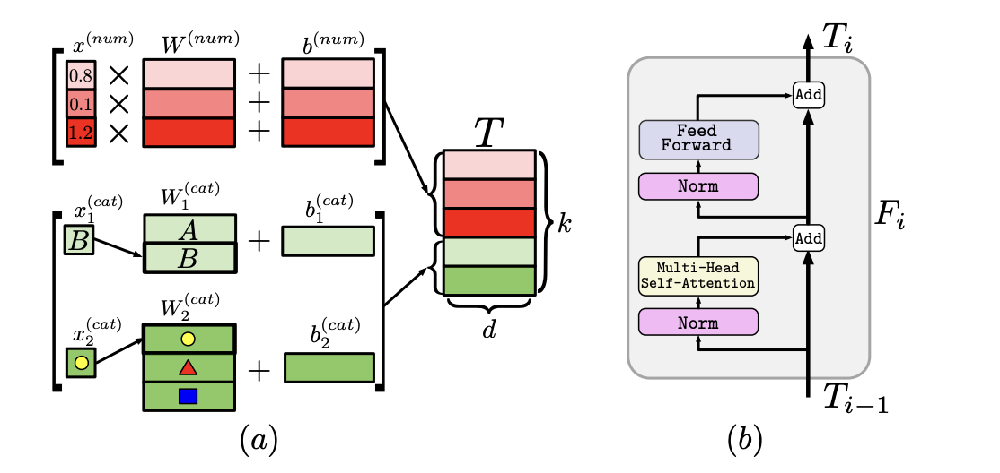
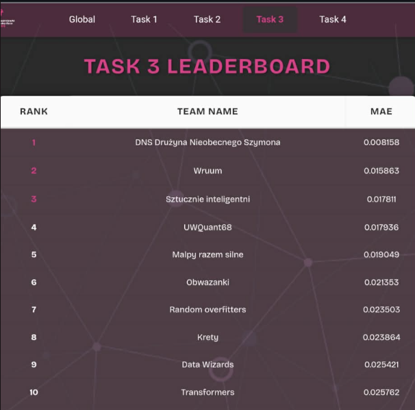

## Prolog
Przyznaję bez bicia, trochę zbierałem się do napisania tego wpisu. Zmęczenie po hackathonach potrafi dać w kość, a opisanie tego, co udało nam się osiągnąć podczas tych 24 godzin, to nie lada wyzwanie, bo prób oraz wielorakich podejść było mnóstwo. Jednakże teraz, patrząc przez okno pociągu jadącego z Suwałk do Poznania, czuję, że wena przejmuje nade mną kontrolę, zupełnie jak aktualizacja Windowsa w randomowy wtorek o 12:40.

Wena weną, ale rzeczywistość, z którą musieliśmy się zmierzyć na miejscu, była zdecydowanie mniej poetycka. Wyobraź sobie tabelę mającą 64 miliony wierszy. Wiem, że to zadanie jest dosyć trudne, dlatego śpieszę z pomocą. 64 miliony wierszy zapisanych czcionką Times New Roman (font size 12) to około 1 300 000 stron A4 (estymacja by Gemini).

Co więcej, wyobraź sobie, że czytasz te 1 300 000 stron A4, a następnie masz na ich podstawie przewidzieć obciążenie sieci elektrycznej dla jakiegoś urządzenia. Zgadza się - nie jest to najłatwiejsze zadanie, dlatego, jak dobrze wiemy, do tego typu wyzwań pierwsze co wyciągniemy, to drzewa decyzyjne. My również tak zrobiliśmy na początku! Jednak po kilku godzinach postanowiliśmy zrobić coś kompletnie innego i użyliśmy architektury, która z założenia miała służyć do przetwarzania tekstu, a w ostatnim czasie jest adaptowana do wielu innych dziedzin. Nie przedłużając, opowiem Wam, jak ten eksperyment przyniósł nam **1. miejsce na 45 drużyn** i dlaczego czasami warto wyrzucić bezpieczną instrukcję przez okno. 

## **Krótki wstęp o formule hackathonu EnsembleAI**
Aby zrozumieć, jakie emocje towarzyszyły mi oraz zespołowi podczas tej zażartej walki, musimy zacząć od opisu formuły hackathonu, bo jest ona co najmniej nietypowa i zapewnia strzały dopaminy mocniejsze niż Reelsy z Instagrama.
Każde z 4 zadań jest oceniane oddzielnie, a punktacja przydzielana jest na podstawie podesłanych rozwiązań, specyficznych dla każdego zadania. W przypadku zadania 3, którym się zajmowałem, był to na przykład plik CSV z predykcjami miesięcznego obciążenia sici elektrycznej dla konkretnego przedziału czasu. Przez taką organizację newralgiczną częścią hackathonu była strona z leaderboardem, gdzie mogliśmy podejrzeć ile punktów mamy w danym zadaniu.
Rozwiązania można było przesyłać tylko co określony z góry czas, by między innymi uniknąć DDOS-owania serwerów. A więc, jak widać, po każdym kolejnym przesłaniu pliku następował pełen napięcia okres oczekiwania: czy i o ile nasze rozwiązanie poprawiło pozycję w rankingu.


## **Ale może od początku: co, jak, gdzie i w ogóle po co?**
Wyzwanie przygotował dla nas jeden z partnerów hackathonu – Euros Energy, od którego dostaliśmy również dane. Zatem o co w ogóle chodziło? Brief z opisem problemu nakreślał nam szerszy kontekst: masowa elektryfikacja to absolutny kamień milowy transformacji energetycznej w Polsce. Jednak dla dystrybutorów prądu szybki wzrost liczby instalacji, w tym głównie pomp ciepła, stwarza ogromne wyzwania. Mówiąc krótko: precyzyjne prognozowanie zapotrzebowania na energię jest wręcz niezbędne, aby zapobiec przeciążeniom sieci i wynikającym z nich awariom.

## **Dane, jakie dostaliśmy**
Jak mówimy o uczeniu maszynowym i predykcjach, to wstyd nie zacząć od opisu danych, jakie otrzymaliśmy, a więc by nie siać niezadowolenia, zacznijmy: 

Każdy zespół miał do dyspozycji 3 główne zbiory:
- **Train**: Październik 2024 – Kwiecień 2025
- **Validation**: Maj 2025 – Czerwiec 2025
- **Test**: Lipiec 2025 – Październik 2025

Na tym ostatnim zbiorze wykonywaliśmy predykcje przy każdym submission, ale tutaj pojawia się haczyk, który decydował o wszystkim. To był mechanizm znany z Kaggle: Public vs Private Leaderboard. Zbiór Test był niby jawny i każdy go miał, ale... brakowało w nim naszego „y” (celu predykcji). Nie było więc mowy o douczeniu modelu czy sprawdzeniu wyniku na własną rękę.

Przez całe 24 godziny walczyliśmy „po omacku”, widząc na tablicy wyniki tylko dla wycinka tych danych. Jednak te punkty nie miały  takiego znaczenia w końcowej klasyfikacji! Finalna ocena, która decydowała o podium, została przeliczona na pozostałej, całkowicie zatajonej części zbioru Test, której wyników nikt nie znał do samego końca. To sprawiło, że ostatnie minuty hackathonu to była czysta loteria emocjonalna, bo specyfika lata mogła być zgoła inna niż okresu jesienno-zimowego, na którym głównie trenowaliśmy.

W praktyce ocenianie wyglądało tak:
<div style="border-left: 4px solid #59ff00; padding: 15px 5px; margin: 20px 0;">
  <table style="width: 100%; border-collapse: collapse; font-family: sans-serif; font-size: 1.4rem;">
    <thead>
      <tr style="border-bottom: 2px solid #555;">
        <th style="text-align: left; padding: 10px;">Score</th>
        <th style="text-align: left; padding: 10px;">Months used</th>
        <th style="text-align: left; padding: 10px;">Weights</th>
      </tr>
    </thead>
    <tbody>
      <tr style="border-bottom: 1px solid #ddd;">
        <td style="padding: 12px 10px;"><strong>Leaderboard (visible)</strong></td>
        <td style="padding: 12px 10px;">Validation only (May – Jun 2025)</td>
        <td style="padding: 12px 10px; color: #bbffd8;">-</td>
      </tr>
      <tr>
        <td style="padding: 12px 10px;"><strong>Final score</strong></td>
        <td style="padding: 12px 10px;">Validation + Test (May – Oct 2025)</td>
        <td style="padding: 12px 10px;"><strong>2/6 valid</strong> + <strong>4/6 test</strong></td>
      </tr>
    </tbody>
  </table>
</div>

Ostatecznie w danych mieliśmy ok. 600 różnych sensorów, które nadsyłały nam logi w odstępach 5-minutowych w przedstawionych powyżej okresach, co dawało nam ok. 64 miliony wierszy (10.42 GB!) do analizy.

## **Cel** 
Krótko i na temat: celem predykcji nie była chwilowa moc, a średnia miesięczna wartość wskaźnika obciążenia sieci (x2) dla każdego urządzenia. Przechodziliśmy więc z danych o wysokiej rozdzielczości (odczyty co 5 minut) na poziom agregatów miesięcznych. Na dole wrzucam dokładny i piękny wzór zawarty w opisie zadania:

> Dla każdego urządzenia **d** i miesiąca prognozy **m**, należy przewidzieć **średnią wartość x2** ze wszystkich 5-minutowych odczytów w danym miesiącu:
>
> <p align="center" style="font-size: 1.8rem; padding: 10px 10px 10px 4px; background: rgba(0,0,0,0.05); border-radius: 8px;">
>   <b>target<sub>d,m</sub> = (1 / N<sub>d,m</sub>) * &sum; x<sub>2</sub><sup>(d,m,i)</sup></b>
> </p>


A metryką oceny na _live_ oraz ostatecznym leaderboardzie było MAE:
> <p align="center" style="font-size: 1.8rem; padding: 10px 10px 10px 4px; background: rgba(0,0,0,0.05); border-radius: 8px;">
>   <b>MAE = (1 / n) * &sum; | y<sub>i</sub> - ŷ<sub>i</sub> |</b>
> </p>
Także co, pora opisać nasze starania oraz drogę, która poprowadziła nas prościutko na 3 miejsce w całym hackathonie!


## **Feature Engineering oraz Preprocessing danych**
Na samym starcie trzeba przyjrzeć się blisko danym oraz rozkładom i tak też zrobiłem, ale jeszcze przed tym, na samym końcu instrukcji dostarczonej przez organizatorów, mogliśmy znaleźć taką oto sekcję:



W tamtym momencie pomyślałem, że koniecznie musimy od tego zacząć i dodać do każdego z sensorów informację, do jakiego dystrybutora energii należy. W końcu każdy team pewnie to zrobi, prawda? Prawda?? No finalnie okazało się, że nie :D i kto wie, może to nam dało te kilka punktów więcej?

W danych mieliśmy takie informacje jak szerokość oraz długość geograficzna każdego sensora, a więc na tej podstawie postanowiłem zlokalizować każde urządzenie w konkretnym województwie, odpytując API GeoPy. Okazało się, że dane zostały zanonimizowane (?) albo były w nich błędy, bo niektóre lokalizacje były niepoprawnie umiejscowione i GeoPy nie mogło znaleźć odpowiedniego dopasowania. W takich wypadkach użyliśmy algorytmu KNN do znalezienia najbliższego urządzenia, które ma poprawne współrzędne. Później stworzona mapa przypisywała każde województwo do jednego z dystrybutorów energii takich jak PGE, Enea lub Tauron i tak oto mieliśmy pierwszy ciekawy feature.

Kolejnym ważnym aspektem jest agregacja danych. Było ich naprawdę mnóstwo, co mogło przytłoczyć niejeden model, więc decyzja padła na agregację godzinową. Zmniejszało to całkiem znacznie zbiór danych, eliminowało szum z zapisów prowadzonych co 5 minut, dawało przestrzeń na wykrycie schematów, a także było wartościową jednostką predykcyjną.

Ogólnie problem był dosyć ciekawy, bo na początku podchodziłem do tego zadania jak do predykcji szeregów czasowych. Jednak po głębszym zastanowieniu, tak naprawdę mamy tu **najzwyklejszy problem regresji**. Wiadomo, interwały są prowadzone co 5 minut, ale predykcja to predykcja MIESIĘCZNA! Przy takim rozmyciu szczegółów na rzecz skali makro, jakby to powiedział mój profesor z politechniki: musimy ewidentnie użyć jak najbardziej precyzyjnej siekiery, a nie skalpela. Co więcej, w miarę uniwersalnej siekiery, która będzie umiała powiązać ważne cechy jesienią, po czym zaaplikować je również latem.

## **Pierwsze podejście** 
Jako pierwsze podejście zdecydowałem się na CatBoosta. Było trochę cech kategorycznych oraz liczbowych, więc postanowiłem, że drzewa boostingowe mogą się całkiem dobrze odnaleźć w tym świecie. Także na start wleciał właśnie CatBoost z następującymi hiperparametrami (wtedy jeszcze bez strojenia):
```python
CatBoostRegressor(
   iterations=800,
   learning_rate=0.05,
   depth=6,
   loss_function="MAE",
   cat_features=CATEGORICAL_FEATURES,
   random_seed=42,
   verbose=100,
)
```
I jak to się mówi: benc! Siadło, a do tego grubo, bo nasz pierwszy model miał 0.0074 MAE. 0.0074!!! Kurczę, to naprawdę jest mało... Szczególnie przy agregacji miesięcznej oraz przy takiej specyfice danych!



Po tym nastąpiła salwa kolejnych faz inżynierii cech, błądzenia i eksploracji zbioru. Summa summarum inne zespoły również dobrały się do podobnych wyników, a ostatecznie nas przeskoczyły, więc jako ostatni krok użyliśmy Optuny do optymzalizacji hiperparametrów, by wycisnąć z CatBoosta, ile się dało. Otrzymaliśmy wynik MAE na poziomie 0.0044. Każda z kolejnych wersji to naprawdę była ciężka walka i nadal uważam, że zejście na samym drzewku do takiej wartości to było naprawdę osiągnięcie. Tym bardziej, trochę spoilerując, że jednak Transformer to architektura znacznie, ale to znacznie cięższa, więc nawet trudno porównać te dwa modele między sobą, bo stoją one na dwóch różnych końcach efektywności oraz wymagań obliczeniowych. Także finalnie i tak mogę uznać ten wynik za naprawdę dobry jak na naszą wiedzę oraz umiejętności.

## **Autoboty do boju**
Kiedy porzuciliśmy nasze piękne drzewko? Po pierwsze wtedy, gdy naprawdę poczułem, że kolejne zmiany, próby oraz feature engineering nic nie zmieniają albo zmieniają na tyle mało, że nie jesteśmy w stanie skoczyć wyżej w rankingu. Po drugie: kiedy drużyna  o nazwie "Transformers" nam nakopała, a tym samym, można powiedzieć, nas natchnęła...
Po krótkim researchu postanowiłem wyciągnąć naprawdę, ale to naprawdę ciężkie działa, a mianowicie Feature Tokenizer Transformer (FT-Transfomrmer). Jest to, można powiedzieć, w miarę świeża architektura, która zdobywa ostatnio coraz większą popularność podczas kagglowych zawodów.


### Ogólny zamysł i sposób działania Feature Tokenizer Transformera

Zawarty poniżej opis opiera się na pracy, która właśnie [FT-Transformera wprowadziła](https://arxiv.org/abs/2106.11959). Oczywiście obrazki również pochodzą z tego samego źródła.

Od początku. Jak wiemy w datasetach mamy głównie do czynienia  z dwoma typami cech: nominalne, czyli takie jak kategorie, oraz numeryczne, przedstawiające konkretną wartość liczbową.

Transformery zostały szeroko wykorzystane w przetwarzaniu języka naturalnego (NLP) w modelach generatywnych, takich jak GPT, czy koder-dekoder, takich jak T5. Jak więc zmusić naszą architekturę do przetwarzania tym razem nie konkretnych embeddingów stworzonych z tokenów, a właśnie kategorii i liczb jednocześnie?

### Główny komponent: Feature Tokenizer

I właśnie za to odpowiada nasz komponent Feature Tokenizer. Jest on taką perełką tego podejścia, a działa na dwa konkretne sposoby:

- **Cechy numeryczne:** Tutaj sprawa jest względnie prosta --> bierzemy naszą liczbę, mnożymy ją przez wyuczony wektor wag o długości naszego wyjściowego embeddingu, dodajemy bias i tak właśnie nasza wartość liczbowa rozciągnęła się, tworząc nam embedding o zadanej wielkości.
    
- **Cechy kategoryczne:** I tutaj działa to dosyć podobnie jak przetwarzanie słów w NLP. Każda wartość cechy na początku jest transformowana do reprezentacji _one-hot encoding_, a następnie jest wymnażana przez macierz wag. Tak w skrócie matematycznie działa to po prostu jak wybieranie konkretnego wiersza z tej macierzy plus wiadomo bias.
    

>_One-hot encoding_ to zmiana reprezentacji danej wartości kategorycznej na ciąg binarny. Brzmi to dziwnie, ale jest naprawdę proste. Przykład: mamy cechę "Kolor" w datasecie motocykli. W naszym datasecie mamy dwa kolory – czerwony i czarny. Wrzucając to w wektor, możemy to zrobić tak: `[Czerwony, Czarny]`, a więc na pierwszym miejscu mamy wartość czerwony, a na drugim wartość czarny. Reprezentacja _one-hot encoding_ to tak jakby zapalanie lampek, więc jeśli mielibyśmy przedstawić, że motocykl jest czerwony, to byłoby to tak: `[1,0]`, a czarny to `[0,1]`.

Następnie wszystkie wartości naszych cech są połączone za pomocą konkatenacji w wielką macierz **_T_**. Dodatkowo na samą górę doklejany jest losowo zainicjowany wektor `[CLS]` o takiej samej długości. Dalej cała ta macierz jest przetwarzana i podana do naszego Transformera, tak więc **_T_** reprezentuje nam tak jakby jeden wiersz w naszej tabeli (oczywiście wliczając w to ten dodatkowy wektor `[CLS]`). Na dole wizualizacja, jak to się prezentuje:



Ale po co ten `[CLS]`? CLS to skrót od _Classification_, a głównym zadaniem tego wektora jest zbieranie informacji podczas przejścia przez całą sieć ze wszystkich warstw.

Dalej, jak widać, nasz wektor **_T_** z przetworzonymi cechami ląduje w Transformerze, przechodzi normalizację i następnie idzie do unitu _Multi-Head Self-Attention_. Dzięki tej warstwie model może wyłonić kontekst, jaki jest potrzebny do osiągnięcia wyniku najbardziej zbliżonego do ideału, a w naszym przypadku kontekst to inne kolumny tabeli, czyli wartości z macierzy **_T_**. I właśnie ten kontekst, między innymi, składuje nam wektor `[CLS]`.

A dlaczego ta uwaga jest **„Multi-Head”** ? Podobnie jak w modelach językowych jeden _"head"_ może wyłapywać z tekstu gramatykę, a inna emocje, tak tutaj każda z głów szuka w naszym wierszu danych zupełnie innego kontekstu. Dzięki temu w tym samym czasie jedna „głowa” może śledzić tylko twarde zależności geograficzne (np. obciążenia do województwa/operatora), inna szuka ukrytych powiązań technicznych (model pompy vs obciążenie), a nasz token `[CLS]` dostaje na końcu pełny, wielowymiarowy obraz sytuacji zamiast jednej, uśrednionej papki.

Na samym zaś końcu wyrzucamy wszystkie inne wiersze z macierzy **_T_** prócz naszego `[CLS]`, który zawiera takie meritum czyli całą informację potrzebną do dalszego przetwarzania (w naszym zadaniu do przewidzenia konkretnego obciążenia) i dalej idzie to prosto do klasyfikacji/regresji.

##  Zastosowanie FT-Transformera w naszym zadaniu

###  Ostateczny Feature Engineering 
W trakcie tych 24 godzin dużo testowałem z różnymi feature'ami, nieraz pytając LLMa, czy może on ma jakieś ciekawe pomysły. W sumie wylistuję tu to, co udało się dodać i co finalnie zostało wykorzystane do ostatecznego nauczenia naszego Transformera, ale też część z tych feature'ów została oczywiście użyta do wytrenowania CatBoosta.
- **deviceType**, czyli typ urządzenia, który pomaga modelowi uchwycić różnice w charakterystyce pracy.
    
- **x3** to dodatkowa cecha kategoryczna z danych wejściowych, która wnosi informację o typie krzywej grzewczej.
    
- **operator**, a mianowicie nazwa operatora dostawcy, pozwalająca modelowi uwzględnić różnice wynikające z warunków eksploatacji oraz polityk działania.
    
- **voivodeship** to województwo, czyli kontekst geograficzny wpływający między innymi na klimat oraz sezonowość zachowania systemu.
    
- **device_operator_combo**, czyli połączenie urządzenia oraz operatora, które pozwala łapać interakcje specyficzne dla konkretnej pary.
    
- **t1_mean-t13_mean** oznacza średnią wartość sygnału t1-t13 w oknie czasu opisującą jego typowy poziom.

- **t8_max** wyznacza maksymalną wartość t8 opisującą skrajne piki oraz epizody wysokiego obciążenia.
    
- **t8_std** to odchylenie standardowe t8 mierzące zmienność sygnału.
    
- **t7_max** oznacza maksimum t7, które wskazuje na chwilowe ekstremalne stany systemu.
    
- **t4_min** to minimum t4 przydatne do wykrywania głębokich spadków.
    
- **delta_load** jest zmianą obciążenia między punktami czasowymi pokazującą dynamikę pracy układu.
    
- **delta_source** wyznacza zmianę po stronie źródła, która może odzwierciedlać przełączenia lub skoki warunków zasilania.
    
- **cwu_demand** to zapotrzebowanie na CWU, czyli sygnał popytu wpływający bezpośrednio na pracę systemu.
    
- **delta_temp_out_in** oznacza różnicę temperatury wyjścia oraz wejścia opisującą transfer energii a także efektywność procesu.
    
- **cwu_spike** jest flagą nagłego wzrostu zapotrzebowania CWU pomocną przy modelowaniu krótkich i gwałtownych zdarzeń.
    
- **hour_sin** to sinus z godziny doby, który koduje cykliczność czasu bez sztucznego przeskoku między godziną 23:00 a 00:00.
    
- **hour_cos** stanowi cosinus z godziny doby uzupełniający powyższy sinus i pozwalający modelowi odtworzyć pełną fazę dobową.
    
- **month_sin** jest sinusem z miesiąca reprezentującym sezonowość roczną w sposób ciągły.
    
- **month_cos** to cosinus z miesiąca, który razem z sinusem miesiąca domyka cykliczną reprezentację pór roku.


### Co pod maską? Sieć, głowica i hiperparametry
Teoria teorią, ale teraz pora przejść do tego, jak my te Transformerowe klocki zaadaptowaliśmy do naszego datasetu.

Teoretycznie wspominałem, że liczby są prosto wymnażane przez wektor wag. Jednakże my poszliśmy o krok dalej, a co za tym idzie każda cecha numeryczna była przetwarzana jeszcze przed samym wejściem do Transformera przez małą sieć neuronową, a mianowicie MLP (Multi Layer Perceptron):
```python
nn.Sequential( 
   nn.Linear(1, embed_dim // 2), 
   nn.ReLU(), 
   nn.Linear(embed_dim // 2, embed_dim), 
   )
```
Zrobiliśmy to, bo nie wszystkie cechy mogą wpływać liniowo na wynik, dlatego dorzuciliśmy trochę tej nieliniowości jeszcze przed samym wejściem do Transformera.

Cechy kategoryczne były standardowo zamieniane na embeddingi zgodnie z poprzednim opisem. Jedyne co, to dodaliśmy też miejsce na OOV, czyli Out of Vocabulary, w razie gdyby na przykład konkretny operator czy deviceType był nieznany.
To, co dalej się dzieje, to klasyczny Feature Tokenizer Transformer opisany wcześniej. Jeśli chodzi o hiperparametry, to zastosowaliśmy:
- Embedding size: 64
- Multi head attentions: 8
- Transformer layers: 3
- Dropout: 0.1

Po tym, jak nasze dane przejdą przez wszystkie warstwy Transformera, dochodzimy do finału, czyli tzw. głowicy regresyjnej. Tutaj sprawa jest prosta: wyciągamy z całej macierzy tylko ten jeden, konkretny wektor [CLS], o którym pisałem wcześniej. Dlaczego akurat jego? Bo dzięki mechanizmowi atencji to właśnie on "nasiąkł" informacjami ze wszystkich pozostałych kolumn i ma w sobie skondensowaną wiedzę o całym wierszu danych.

Resztę wektorów (tych odpowiadających za np. region) po prostu odcinamy, bo wykonały już swoją robotę. Nasz [CLS] trafia do ostatniej, malutkiej sieci neuronowej składającej się z warstwy normalizacji i aktywacji ReLU, która ostatecznie "zgniata" te wszystkie skomplikowane liczby do jednej, finalnej wartości.

Na samym końcu dorzuciliśmy jeszcze twardy bezpiecznik. Skoro przewidujemy obciążenie energii, to ujemny wynik fizycznie nie ma sensu, więc ucięliśmy wszystkie wartości poniżej zera, pilnując, żeby model nie wypluwał bzdur.

### Faza treningu

Kilka słów o tym, jak w ogóle podeszliśmy do uczenia naszego modelu. Starałem się to zrobić najbardziej optymalnie, by nie trenować bez sensu naszego Transformera oraz nie marnować tak ważnego na hackathonie czasu. Mieliśmy dwie główne fazy:

**Faza 1, czyli taki poligon doświadczalny** Zamiast trenować na wszystkim, zrobiłem twarde cięcie w czasie na początku lutego. Model uczył się na danych sprzed tej daty, a następnie miał przewidywać przyszłość, czyli to, co działo się po 1 lutego. Dlaczego podział po dacie, a nie losowy? Bo w przypadku obciążenia sieci elektrycznej losowy podział spowodowałby wyciek danych, czyli model widziałby "przyszłość", żeby przewidzieć "przeszłość". W tej fazie dorzuciliśmy też Early Stopping, by model przerywał naukę, gdy przestanie się poprawiać. Oczywiście zapisywaliśmy wszystkie checkpointy. Dzięki tej fazie wiedzieliśmy, jakie jest nasze realne MAE, zanim w ogóle wysłaliśmy cokolwiek do organizatorów.

**Faza 2, czyli cała naprzód** Gdy po wielu testach w Fazie 1 upewniliśmy się, że nasza architektura działa stabilnie, to przeszliśmy właśnie do Fazy 2 --> **więcej danych = lepszy model**. Na sam koniec zdjęliśmy blokadę z 1 lutego i wrzuciliśmy do pieca absolutnie wszystkie dostępne dane treningowe z przeszłości. Tak potężnie nafeedowany oraz wyregulowany model wygenerował ostateczne predykcje, które trafiły do naszego finałowego pliku _submission_.

### Mały tip na sam koniec
Warto jeszcze wspomnieć, że sam Transformer uczył się przeskalowanej wartości wskaźnika x2, zrealizowanej za pomocą StandardScalera. Sieci neuronowe lubią na ogół normalizację, więc to też mogło dołożyć swoją cegiełkę do stabilniejszego i bardziej efektywnego uczenia naszego FT-Transformera. Przed samym zapisaniem przewidzianej wartości do pliku wynikowego była ona w odpowiedni sposób przeskalowana do oryginalnego przedziału wartości.


### Triumf Transformera
Kiedy opadł kurz, siedzieliśmy sobie w stołówce, zajadając pyszny obiad rodem z tych u babci. Byliśmy już trochę pogodzeni z myślą, że na top 10 nie mamy co liczyć. Ale wiadomo ciekawość to pierwszy stopień do... sprawdzenia wyników. Zagryzając kotleta, postanowiłem zerknąć na Final Score.

A tu okazuje się, że nasza siekiera była nie tylko precyzyjna, ale i rozbiła bank. Z wynikiem **0.008158** wyprzedziliśmy drugie miejsce o **niemal 100%** (ich MAE było prawie dwukrotnie wyższe!). To był ten moment, w którym loteria emocjonalna zamieniła się w falę euforii. Jednak przeżuwanie kotleta musiało gwałtownie nabrać tempa --> trzeba było biec dopracować **pitcha**.

P.S. W temacie obiadu: organizatorzy, jeśli to czytacie – ten posiłek na każdej edycji jest jak **dar od bogów**. Nie zmieniajcie tego! Działa on jak balsam na żołądek zmaltretowany toną pizzy i litrami energetyków.


##  Epilog
Zatem, czemu to mogło zadziałać, a nawet teraz już można powiedzieć, że **zadziałało**? 
Po pierwsze, zderzyliśmy się z charakterystyką drzew decyzyjnych: nie są stworzone do problemów ekstrapolacji. Każde drzewo tworzy sztywne podziały, których uczy się w trakcie treningu. Ale co, jeśli latem model zobaczy wartości zupełnie spoza zbioru treningowego? Z tym problemem znacznie lepiej radzą sobie architektury typu Transformer, które uczą się ciągłych relacji i nie są ograniczone sztywnymi ramami.

Po drugie cóż, wiadomo, że ciężko powiedzieć coś na 100%, bo jednak tak duże oraz złożone sieci neuronowe to taka czarna skrzynka. Na pewno każda z wymienionych wcześniej praktyk kształtowała po trochu końcowy wynik. Jednak gdybym miał już coś wytypować, co mogło mieć większy wpływ, to położyłbym nacisk na ten sławetny mechanizm _Multi-Head Self-Attention_.

Głównym problemem oraz wyzwaniem w tych danych było wyciągnięcie uniwersalnej wiedzy z miesięcy jesienno-zimowych, kiedy pompa ciepła zazwyczaj działa na pełnych obrotach i przeniesienie jej na letnie obciążenie, kiedy to wykorzystanie pomp jest znacznie mniejsze. W FT-Transformerze mechanizm kontekstu mógł modelować, jak mocno dane cechy mają wpływ na wynik oraz jak bardzo konkretne atrybuty powinny być brane pod uwagę w szczególnych przypadkach. Dodatkowo jeszcze nasz nieliniowy MLP, który przetwarzał nasze wartości numeryczne, też mógł wzbogacić te cechy i nadać im konkretny wpływ na wynik. Jak wiemy, Transformery nieźle generalizują i wydaje mi się, że to właśnie ta cecha zagrała pierwsze skrzypce w tym zadaniu. 

Niemniej jednak trzeba oddać honory innym drużynom, które były tuż pod nami. Mimo iż druga drużyna miała wynik gorszy od naszego (niemal dwukrotnie!!), to chyba jako jedyni wyciągnęliśmy tak ciężkie działo jak Transformer do tego zadania. Inne drużyny korzystały z drzew regresyjnych takich jak LightGBM i biorąc pod uwagę różnicę w skomplikowaniu naszej oraz ich architektury, to wykonali oni naprawdę świetną robotę. Niemniej jednak to nam udało się wyjść na prowadzenie i z naszego rozwiązania możemy być dumni!

## To co... za rok?
Kolejny EnsembleAI i kolejny raz świetnie się na nim bawiłem. Wielkie dzięki dla organizatorów za tak świetny event oraz dla mojej drużyny DNS, czyli Drużyny Nieobecnego Szymona, w składzie:
- [Jakub Hudziak](https://www.linkedin.com/in/jhudziak/)
- [Jakub Binkowski](https://www.linkedin.com/in/jakub-binkowski-80136825b/)
- [Maciej Kaszkowiak](https://www.linkedin.com/in/maciej-kaszkowiak/)
- [Maciej Mazur](https://www.linkedin.com/in/maciej-mazur-90064b2b4/)
- oraz oczywiście ja :D

Daliśmy ognia chłopaki i mam nadzieję, że nie po raz ostatni! Chyba się już powtarzam, jednak mówię to za każdym razem szczerze. To co, do zobaczenia za rok?
