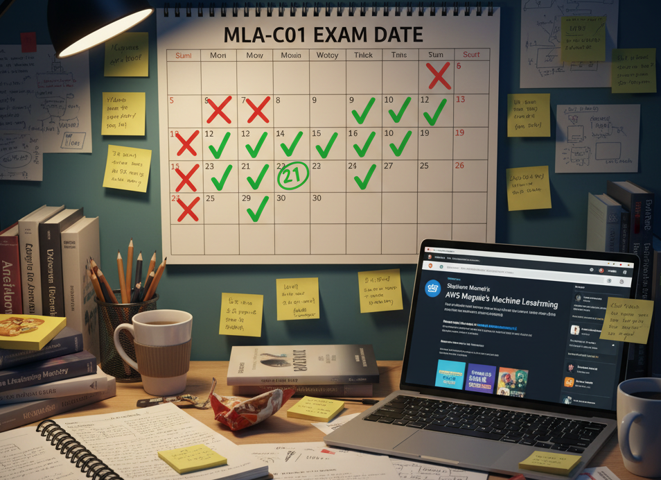

# MLA-C01: Jak zdałem egzamin Machine Learning Engineer - Associate

## Początki

Ostatnio udało mi się z sukcesem zdać pierwszy certyfikat związany z chmurą. Padło na AWS Machine Learning Engineer - Associate i szczerze powiem, że postanowienie, by zdawać akurat ten konkretny certyfikat, było dość szalonym wyborem :D. Czemu? Architekturę AWS-a znałem poprzednio na bardzo podstawowym poziomie. Nauczyłem się jej trochę podczas tworzenia mojej pracy inżynierskiej we współpracy z OLX. Miałem wtedy okazję skorzystać z takich serwisów jak Cognito, S3, Translate czy kilku modeli z Bedrocka. Nie wiedziałem dosłownie nic o pojęciach typu VPC czy IAM, co oczywiście jest dosyć naturalne, bo nie były mi najzwyczajniej potrzebne podczas rozwijania projektu.

Jednakże wracając, czemu akurat TEN certyfikat? Mianowicie w pracy ukazało się ogłoszenie, że można wziąć udział w kursie, którego ukończenie pozwoli otrzymać voucher na egzamin. W tamtym momencie miałem na uczelni przedmiot ściśle związany z takimi pojęciami jak MLOps (Machine Learning Operations), który pokazał mi, jak bardzo podoba mi się ta tematyka, a wręcz fascynuje (pozdrawiam Janka, naszego prowadzącego ;)). Takim oto właśnie sposobem nie zastanawiałem się długo, w kilka sekund wypełniłem formularz i finalnie znalazłem się na liście kursantów.

Uważam, że kurs był dosyć wartościowy. Nie pamiętam dokładnie, jaka tematyka była poruszana na części wykładowej, ale każde nasze spotkanie kończyło się labami, na których mogliśmy porobić i pobawić się między innymi SageMakerem (platforma do budowania, trenowania i wdrażania modeli). Uważam, że to było wartościowe pod względem na pewno praktycznym i wiadomo, przetwarzanie i uruchamianie modeli na SageMakerze jest dosyć drogie, więc nie miałem dużo okazji (okrągłe zero) wcześniej z niego skorzystać. Po kursie otrzymałem voucher i tutaj zaczęła się moja dosyć przydługa droga prowadząca do egzaminu.

## Przygotowania

Na wstępie chciałbym zaznaczyć, że pierwszy semestr specjalizacji Sztuczna Inteligencja uważam za jeden z najcięższych w czasie całych studiów: projektów było mnóstwo, egzaminy nie były najprostsze, a to wszystko przy akompaniamencie pracy na 3/4 etatu. Jednym słowem: jazda bez trzymanki. Dlatego też, kończąc kurs w kwietniu, postanowiłem przenieść datę egzaminu na czerwiec – wtedy jeszcze mi się wydawało, że ma to bardzo dużo sensu. Bez przedłużania skoczmy więc do czerwca.

W czerwcu po zakończeniu sesji (bez poprawek) uświadomiłem sobie, że nie mam totalnie siły po pracy ( już na pełen etat) siadać jeszcze i kuć do egzaminu, więc przerzuciłem naukę na lipiec.

No i w lipcu wiadomo jak to wakacje… aa, mam Was ;) W lipcu naprawdę zacząłem przygotowania, a jak już mowa o przygotowaniach, to kończę z formą mojego kochanego pamiętniczka i przechodzę do bardziej merytorycznego tonu, by każdy, kto przyszedł tu po „mięcho”, czyli jak zdać egzamin MLA-C01, wiedział, jak mi się to udało.

## Jak uczyłem się do egzaminu?

Najważniejsze odkrycie i coś, co bardzo mi pomogło, to grupa [AWSCertifications](https://www.reddit.com/r/AWSCertifications/) na Reddicie. W skrócie: jest to zagłębie ludzi, którzy zdają, zdali lub uczą się na swoje egzaminy z AWS-a. Można tam znaleźć dosłownie wszystko w tej tematyce, od notatek po porady jak odpowiadać na pytania i je analizować. Codziennie pokazują się tam nowe wpisy, więc polecam sobie poczytać doświadczenia wielu ludzi, którzy przeszli już tę samą drogę.

Po przeczytaniu miałem pierwszy wniosek: trzeba zacząć od kursów Stephane'a Maareka na Udemy. Tak też zrobiłem i obejrzałem ok. 24h wykładów mówiących o całym przekroju egzaminu. Od przetwarzania danych po udostępnianie modeli na SageMakerze. Na początku starałem się robić własne notatki i na pewno byłoby to wartościowe, ale zaznaczę, że nie wiedziałem nic i wszystko, co słyszałem, było dla mnie nowe. Co więcej nie zajęłoby to 24h, a pewnie dwa razy tyle. Po kilku działach przerwałem i postanowiłem chłonąć wiedzę na bieżąco i zrozumieć najwięcej, jak się da. Także ten krok polecam każdemu, ja słuchałem tych wykładów nie tylko je uważnie oglądając, ale czasem przygotowując obiad i wydaje mi się, że nawet w takiej formie coś mi tam w głowie zostało.

Warto zaznaczyć (to jest rzecz, którą wiem właśnie z Reddita), że niektóre działy, takie jak przetwarzanie danych, Stephane Maarek wziął z innych egzaminów, i to bardziej zaawansowanych. Czasem wiedza jest mocno szczegółowa, może nawet za bardzo jak na poziom Associate (mamy 4 główne poziomy egzaminów AWS, od najłatwiejszego do najtrudniejszego z największą ilością szczegółów: Practitioner, Associate, Specialty, Professional). Niemniej jednak po egzaminie uważam, że warto wiedzieć więcej niż mniej, bo niektóre pytania były naprawdę bardzo szczegółowe. Dodatkowo jest też segment o popularnych architekturach i omawiana jest architektura Transformer – to na pewno można pominąć i, jak ktoś się spieszy, to polecam. Jak nie, to zawsze warto poszerzyć horyzonty.

Po wykładach wziąłem kolejny kurs od Stephane'a Maareka - Praktyczne egzaminy. Trzy pełne praktyczne egzaminy, które są naprawdę trudne. Świeżo po obejrzeniu wykładów osiągnąłem kolejno: 66%, 67% i 70%. A aby zdać egzamin, potrzebujemy 72%. Mimo że wyniki nie były najlepsze, to właśnie z tych praktycznych egzaminów dowiedziałem się i zapamiętałem najwięcej. Dlaczego? Bo chyba tak działam i mimo że nadal to były pytania ABC, to mają one dosyć praktyczny wydźwięk, a więc analizujemy, jakie rozwiązania są najlepsze dla danej „historyjki”, np.: firma A chce sobie wyhostować model, chce to zrobić najtaniej, ale musi zwrócić uwagę na to, że w ruchu w ich aplikacji są nagłe nieprzewidywalne skoki – czego muszą użyć? I z każdym kolejnym pytaniem analizujemy i dowiadujemy się, jakie rozwiązanie dostępne na AWS najlepiej do tego zastosować, jaką mają specyfikę i oczywiście cenę.

Podobał mi się ten format i mimo że był z początku dosyć trudny, tak był znacznie lepszy dla mnie niż słuchanie suchych wykładów (aczkolwiek nadal polecam to zrobić). Rekomenduję też zwrócić uwagę na czysto Machine Learningowe aspekty: regularyzacja, overfitting, metryki czy nawet kwantyzacja lub fine-tuning, taki jak LoRa.

Po przerobieniu testów nadal nie czułem się pewnie, a że uczenie się na błędach okazało się u mnie efektywne, postanowiłem poszukać kolejnych testów. I tutaj wchodzi Tutorials Dojo - fajne odświeżenie, ale testy znacznie prostsze niż na realnym egzaminie oraz testy Maareka. Było kilka ciekawych i nietuzinkowych pytań, ale uważam, że warto je zrobić w celu eksploracji wiedzy i poznania kolejnych przypadków użycia serwisów, niż dla realnego przygotowania do pytań na oryginalnym egzaminie. Niemniej jednak nadal bym je zrobił, tylko w innej kolejności: Wykłady Maareka, Pytania Tutorials Dojo i na końcu, jako finałowy boss, Egzaminy Maareka.

Ja po przerobieniu egzaminów od TD (Tutorials Dojo) wróciłem ponownie do egzaminów Maareka (od momentu, kiedy je robiłem, minęły około 2 miesiące, wiecie, urlop i takie sprawy...) i na drugim podejściu uzyskałem kolejno: 81%, 86% i 81%. Podczas kolejnego podejścia do robienia tych egzaminów robiłem kompleksowe notatki, zarówno z pytań, w których popełniłem błędy, jak i również tych poprawnych, bo czasem czujemy odpowiedź, ale nie jesteśmy pewni - ją też warto przeanalizować, zrozumieć i uzyskać pewność w wyborze.

Po powyższym zapisałem się na egzamin i do egzaminu przez te kilka dni czytałem tylko pełną prezentację Maareka oraz własne notatki. Na egzaminie miałem dodatkowe 30 minut akomodacji ze względu na to, że nie jestem native'em i nie powiem, dosyć się przydało. Podczas pierwszego obiegu po pytaniach nie marnowałem dużo czasu i zaznaczałem taką odpowiedź, jaką czułem i rozumiałem najbardziej, ale dzięki temu udało mi się w czasie zrobić 2 takie przebiegi. Drugi  już na spokojnie, analizując mocno każde pytanie, co pozwoliło mi przemyśleć odpowiedzi i finalnie zmienić 7-8 z nich, bo odkryłem kilka słów-kluczy zarówno w odpowiedziach, jak i pytaniach. I tak oto ok. 11h po egzaminie dostałem wiadomość, że zdałem z wynikiem 818 i jestem z niego całkiem dumny (tak samo jak z odznaki, którą otrzymałem od AWS-a)

Sam egzamin podsumowałbym jednym słowem: tricky. Wiele odpowiedzi wydaje się poprawnych, ale ma jedno słówko, które totalnie zmienia ich sens. Tak samo było z pytaniami. A więc polecam zdekomponować sobie w głowie pytania na składowe, dowiedzieć się, jakie są dokładnie wymagania, co chcemy osiągnąć i na czym się skupić.

## Co teraz?

Wszystkim, którzy się uczą, życzę powodzenia! Dla tych, co nie zdali, mam nadzieję, że moja ścieżka pomoże Wam pokonać egzamin za drugim razem, a reszcie - dzięki za przeczytanie tego posta! W razie co piszcie na mojego maila lub sociale. Chętnie odpowiem na pytania oraz pomogę, jak umiem najlepiej. Na dole wrzucam sekcję dla osób, które chcą po prostu dowiedzieć się skrótowo, jak przebiegała moja nauka. Teraz, jak zawsze, pozostaje pytanie: co teraz zajmie mi głowę…?

## Jak udało mi się zdać MLA-C01 (wersja TL;DR)

* Zacząłem od Reddita: Przejrzałem [AWSCertifications](https://www.reddit.com/r/AWSCertifications/). Super sprawa, żeby zobaczyć, jak inni się uczyli i jakie mają wskazówki.
* Wykłady Stephane Maarek (Udemy): Najpierw obejrzałem cały kurs (~24h). Na tym etapie głównie chłonąłem wiedzę, żeby zrozumieć ogólny obraz.
* Testy Tutorials Dojo: Przerobiłem je jako trzecie, ale polecam jako drugie. Były fajne, żeby poznać więcej przypadków użycia serwisów, ale czułem, że są prostsze niż realny egzamin.
* Testy Praktyczne Stephane Maarek (Udemy): To był dla mnie "finałowy boss" i najważniejszy etap. Te testy są naprawdę trudne (moje pierwsze wyniki to 66-70%) i to z nich nauczyłem się najwięcej.
* Klucz do sukcesu (u mnie): Podczas robienia testów robiłem bardzo szczegółowe notatki. Analizowałem nie tylko pytania, w których popełniłem błąd, ale także te, na które odpowiedziałem poprawnie (zwłaszcza jeśli było to "na czuja"). Chodziło o to, by naprawdę zrozumieć dlaczego dana opcja jest najlepsza. To pozwoliło mi zdobyć wiedzę, zapamiętać i zrozumieć sens.
* Rekomendowana kolejność: Wykłady Maareka -> Testy Tutorials Dojo -> Testy Maareka + robienie dogłębnych notatek.
* Przed egzaminem: Powtarzałem już tylko z własnych notatek i slajdów z kursu Maareka.
* Na egzaminie: Czytałem pytania bardzo uważnie. Są "tricky". Rozbijałem je w głowie na wymagania, szukałem słów-kluczy i zrobiłem dwa obiegi przez wszystkie pytania.