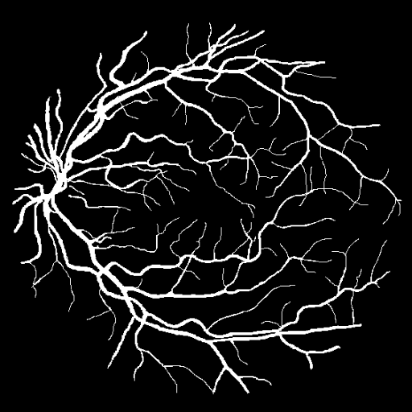
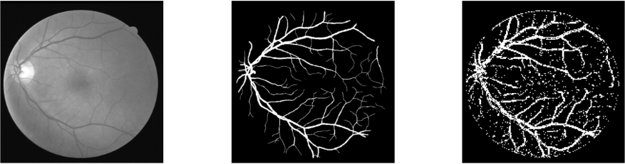
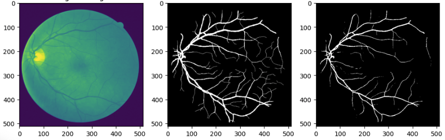

## Słowem wstępu

Projekt został stworzony jako ocena cząstkowa z przedmiotu **informatyka w medycynie**. Nie licząc hackathonu (swoją drogą, polecam wpis [Macieja](https://kaszkowiak.org/blog/ensemble-ai/) na temat tego wydarzenia), było to moje **pierwsze poważniejsze zetknięcie z bibliotekami** takimi jak **PyTorch** czy **OpenCV**.

Ponieważ zadanie okazało się dość wymagające, zmusiło mnie to do **szerokiego researchu** na temat różnych metod przetwarzania obrazów. Sprawdzałem dosłownie wszystko – od najprostszych filtrów po bardziej zaawansowane techniki **computer vision**. Dzięki temu poznałem podstawowe metody używane w tej dziedzinie, co znacznie poszerzyło moje horyzonty.

Nie będę ukrywał – momentami bywało ciężko, zwłaszcza gdy szumy na obrazach niweczyły godziny pracy nad kodem. Mimo to, **wizja wykorzystania technologii do analizy obrazów medycznych** była dla mnie ogromną inspiracją i napędzała mnie do działania. Czasami frustrowałem się, gdy coś nie działało zgodnie z oczekiwaniami, ale **satysfakcja z działającego rozwiązania** zdecydowanie wynagrodziła wszystkie trudy.

## K-Nearest Neighbors (KNN) – Klasyfikacja naczyń krwionośnych

### Czym jest K-Nearest Neighbors?
**K-Nearest Neighbors (KNN)** to jeden z najprostszych i najbardziej intuicyjnych algorytmów **uczenia maszynowego**. Jego działanie opiera się na założeniu, że **podobne dane są blisko siebie w przestrzeni cech**. W skrócie – jeśli chcesz wiedzieć, do jakiej klasy należy nowy punkt, sprawdź, do jakiej klasy należą jego najbliżsi sąsiedzi.

W przypadku projektu **Vessel Extraction** KNN został użyty do:
- **Klasyfikacji pikseli** jako „naczynia krwionośne” lub „tło”,
- **Analizy sąsiedztwa pikseli**, co pozwalało na bardziej precyzyjne rozróżnienie naczyń od szumów.

### Undersampling – Jak poradziłem sobie z niezbalansowanymi danymi?
### Jakie były wyzwania?
- **Nadmiar danych tła** – Obszary bez naczyń krwionośnych (tło) dominowały na obrazach, co powodowało, że model uczył się głównie rozpoznawać tło, a nie naczynia.
- **Niedobór danych naczyń krwionośnych** – Piksele należące do naczyń krwionośnych stanowiły **mniej niż 10%** wszystkich danych, co powodowało, że model bardzo szybko przeuczał się.

  

### Jak sobie z tym poradziłem?
Postanowiłem zastosować **undersampling** – czyli **celowe ograniczenie liczby danych tła**, aby liczba pikseli naczyniowych i tła była bardziej zrównoważona. Brzmi prosto, ale wymagało to kilku przemyślanych kroków:

1. **Wybór próbek tła**:
    - Nie wyrzucałem danych tła losowo, bo mogło to prowadzić do utraty ważnych informacji o kontekście obrazu.
    - Skupiłem się na **reprezentatywnych próbkach**, czyli takich, które znajdowały się blisko naczyń krwionośnych. Dzięki temu model miał lepszy kontekst do nauki.

2. **Redukcja liczby próbek tła**:
    - Ostatecznie **zredukowałem liczbę próbek tła o około 70%**, co sprawiło, że stosunek danych naczyniowych do tła był **bardziej zrównoważony**.
    - Ważne było, żeby nie przesadzić – musiałem zostawić wystarczająco dużo tła, żeby model nie zaczął go mylić z naczyniami.

3. **Zachowanie lokalnych wzorców**:
    - Dzięki zastosowaniu **wycinków 3x3 pikseli** model nie stracił lokalnych wzorców, co poprawiło **dokładność (accuracy)**.

### Jak działało KNN w tym projekcie?
1. **Ekstrakcja cech**:
    - Każdy piksel został opisany za pomocą wartości jasności oraz wartości sąsiednich pikseli.
    - Dzięki temu model miał więcej informacji o lokalnym kontekście.

2. **Wybór liczby sąsiadów (k)**:
    - Najważniejszym parametrem w KNN jest **k** – liczba najbliższych sąsiadów, których klasa będzie brana pod uwagę przy klasyfikacji.
    - W projekcie przeprowadziłem **walidację krzyżową**, żeby znaleźć optymalną wartość **k**.
    - Najlepsze wyniki osiągnąłem dla **k = 5**, co zapewniło **równowagę między dokładnością a czułością**.

3. **Klasyfikacja**:
    - Dla każdego pikselu sprawdzane było, jakie klasy mają jego **k najbliżsi sąsiedzi**.
    - Piksel zostawał przypisany do tej klasy, która miała najwięcej reprezentantów w sąsiedztwie.

### Wyniki i efekty
- **Dokładność (accuracy)**: **89%** – całkiem nieźle jak na prosty model bez głębokiego uczenia!
- **Czułość (recall)**: **85%** – dobrze wykrywał naczynia krwionośne, ale czasami mylił je z cienkimi liniami tła.
- **Precyzja (precision)**: **91%** – model dość skutecznie unikał fałszywych alarmów (błędnego oznaczania tła jako naczyń).

Wiem, że **efekt na pierwszy rzut oka nie powala** i można się zastanawiać, jakim cudem udało się uzyskać tak dobre **"cyferki"** (czyli dokładność). Ale tu właśnie tkwi mały szkopuł, czyli narzucone wymaganie.

Chciałbym zaznaczyć, że do uczenia modelu wykorzystałem **wycinki o rozmiarze 3x3 pikseli**, ponieważ na tak małych fragmentach model łatwiej wykrywa lokalne wzorce charakterystyczne dla naczyń krwionośnych.

Całkowity rozmiar obrazu to **512x512 pikseli**, więc jeśli klasyfikator stwierdził, że **dany wycinek to naczynie krwionośne**, to te **9 pikseli** (3x3) w rezultacie zostało **w całości wypełnione na biało**.

### Zalety i wady KNN
**Zalety:**
- **Prostota implementacji** – KNN jest bardzo intuicyjny i łatwy do zrozumienia.
- **Brak trenowania modelu** – Cała „nauka” odbywa się w momencie klasyfikacji.

**Wady:**
- **Wolne działanie dla dużych zbiorów danych** – Każda klasyfikacja wymaga obliczenia odległości do wszystkich punktów treningowych.
- **Czułość na nieistotne cechy** – Wszystkie cechy mają taką samą wagę, co czasami może prowadzić do błędnych klasyfikacji.

---

## FastAi – Głębokie uczenie dla klasyfikacji naczyń krwionośnych

### Dlaczego FastAi?
Po przetestowaniu klasycznego KNN postanowiłem pójść krok dalej i zastosować **FastAi** – framework oparty na **PyTorch**, który jest świetny do szybkiego prototypowania modeli głębokiego uczenia. FastAi oferuje:
- **Łatwą integrację z gotowymi modelami** (np. ResNet),
- **Prosty w użyciu interfejs API**, który przyspiesza przygotowanie danych i trenowanie modeli,
- **Zaawansowane techniki optymalizacji** (np. learning rate finder).

### Jak działało FastAi w projekcie?
1. **Przygotowanie danych**:
    - Obrazy zostały podzielone na **mniejsze fragmenty** (patches), aby modele mogły łatwiej nauczyć się wzorców.
    - Użyłem **FastAi DataBlock API** do zarządzania danymi i ich etykietowania.
    - Klasyfikacja odbywała się na dwóch poziomach:
        - **Naczynia krwionośne**,
        - **Tło**.

2. **Model głębokiego uczenia**:
    - Wybrałem **ResNet34** – lekki, ale wystarczająco mocny model do rozpoznawania naczyń.
    - Skorzystałem z **transfer learningu**, żeby model uczył się na podstawie gotowych wag (ImageNet), co przyspieszyło trening.
    - **Fine-tuning** na ostatnich warstwach pozwolił dostosować model do specyficznego zadania rozpoznawania naczyń krwionośnych.

3. **Trenowanie i optymalizacja**:
    - Trenowałem model przy użyciu **learning rate finder** FastAi, co pomogło dobrać optymalny współczynnik uczenia.
    - **Augmentacja danych** (rotacje, odbicia, zmiana jasności) pomogła zwiększyć różnorodność danych treningowych i poprawiła ogólną wydajność modelu.

### Wyniki i efekty
- **Dokładność (accuracy)**: **92%** – co jest wyraźną poprawą w porównaniu do KNN.
- **Czułość (recall)**: **90%** – model świetnie radził sobie z rozpoznawaniem naczyń nawet w trudniejszych przypadkach.
- **Precyzja (precision)**: **94%** – minimalna liczba fałszywych alarmów i bardzo precyzyjne wykrywanie naczyń.

### Zalety i wady FastAi
**Zalety:**
- **Wysoka dokładność** – Model głębokiego uczenia znacznie przewyższał KNN pod względem dokładności.
- **Możliwość fine-tuningu** – Dzięki transfer learningowi i fine-tuningowi model szybko dostosował się do specyfiki obrazów medycznych.
- **Proste API** – FastAi pozwala na szybkie eksperymentowanie z różnymi modelami i parametrami.

**Wady:**
- **Wysokie wymagania sprzętowe** – Modele głębokiego uczenia wymagają mocnego GPU do efektywnego treningu, sam korzsytałem z Kaggle do fine tuningu.

## Pierwszy krok w świecie uczenia maszynowego

Muszę przyznać, że to mój **pierwszy indywidualny projekt** związany z **uczeniem maszynowym** i **computer vision**. Poznałem w praktyce działanie **KNN** oraz **FastAi**, zrozumiałem, jak potężne są techniki przetwarzania obrazu i jak radzić sobie z problemem niezbalansowanych danych za pomocą **undersamplingu**. Satysfakcja z wyniku przetwarzania była ogromna, jednakże sam projekt uświadomił mi również, że **jestem dopiero na początku drogi**.

Pomimo wielu błędów i frustracji, poczułem prawdziwą **zajawkę na uczenie maszynowe**. Kombinowanie z danymi, testowanie modeli i optymalizacja algorytmów okazały się czymś, co naprawdę mnie kręci. Wiem, że przede mną jeszcze mnóstwo nauki – zaawansowane architektury sieci neuronowych, optymalizacja hiperparametrów, wydajność na GPU – ale jestem na to gotowy.

Jeśli chcesz zobaczyć kod źródłowy albo dowiedzieć się więcej, zajrzyj do **repozytorium na [GitHubie](https://github.com/benhus8/vessel-recognition/tree/main)**. Może ten projekt zainspiruje Cię do rozpoczęcia własnej przygody z AI?